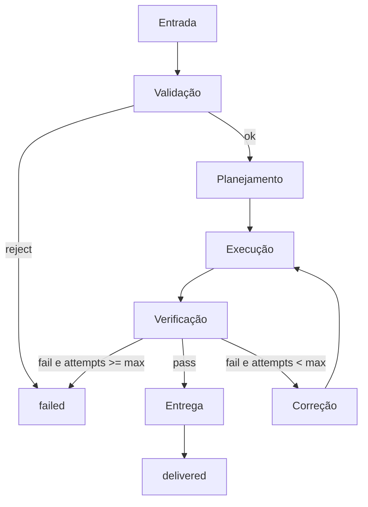

# Skill: AI Workflow Designer

Especialista em transformar tarefas complexas em **pipelines** para a plataforma SaaS multitenant 4Pro_BI.

## Princípios inegociáveis

1. **Toda tarefa complexa vira pipeline** — nunca um passo monolítico opaco.
2. **Estágios canónicos obrigatórios** — Entrada → Validação → Planejamento → Execução → Verificação → Correção → Entrega.
3. **Loops finitos** — toda correção/retry tem `max_attempts`, condição de saída e caminho para falha controlada (DLQ / `failed`).
4. **Multitenancy** — `tenant_id` na entrada, nas mensagens e na persistência; sem acesso cruzado.
5. **Observabilidade desde o desenho** — logs, métricas e status em cada estágio.

Alinhar com: skill `create-ingestion-pipeline`, `docs/AGENTS.md` (Backend Data / Planner), worker Celery (`apps/worker`), estados de ingestão em `.cursor/rules/04-data.mdc`. Complementa (não substitui) multiagente: workflows = **pipeline de trabalho**; multiagente = **quem** executa cada estágio.

## Estágios canónicos (sempre)

| Estágio | Objetivo | Saída mínima | Falha típica |
| --- | --- | --- | --- |
| **1. Entrada** | Capturar pedido tipado + contexto (`tenant_id`, actor, correlation_id) | Envelope validável | Payload incompleto / sem tenant |
| **2. Validação** | Regras de schema, authz, quotas, tipo/tamanho | Input aceite + motivos rejeitados | Validação / 403 / quota |
| **3. Planejamento** | Decompor em steps, dependências, paralelo seguro | Plano versionado + critérios de aceite | Plano inválido / dependência circular |
| **4. Execução** | Correr steps (sync ou fila) com timeouts | Resultados parciais/idempotentes | Timeout / erro transitório / bug |
| **5. Verificação** | Checar aceite, invariantes, isolamento | Verdict pass/fail + evidências | Critério falhou / regressão |
| **6. Correção** | Retry/fallback/compensação **limitados** | Novo attempt ou escalate | Esgotou attempts → `failed`/DLQ |
| **7. Entrega** | Publicar resultado, status final, artefacto, notificação | `done` + métricas do run | Entrega parcial sem status claro |

### Estados do run (fechados)

```
intake → validating → planning → executing → verifying
  → correcting (opcional, bounded) → delivered | failed | cancelled
```

Novos estados exigem nota em docs/ADR. **Proibido** estado que reentra em si sem contador.



## Avaliação obrigatória (antes de executar)

Antes de despachar execução, avaliar e registar:

| Dimensão | Perguntas | Default 4Pro_BI |
| --- | --- | --- |
| **Dependências** | Grafo acíclico? O que é bloqueante vs independente? | Contratos/migrações antes de features; parse após validate |
| **Paralelismo** | Quais steps são independentes? Capacidade máxima segura? | Workers por classe; allowlists sem overlap |
| **Cache** | O que é idempotente e cacheável? TTL? Invalidação? | Redis para hot paths; nunca cache cross-tenant |
| **Memória** | Estado efémero vs contexto do agente vs secrets? | Resumos no Supervisor; segredos só em env |
| **Persistência** | O que sobrevive a crash? Onde? | Postgres (status/metadata); object storage (ficheiros); Redis (fila) |
| **Retries** | Transitório vs permanente? Backoff + jitter? `max_attempts`? | Celery/ack; validação **sem** retry cego |
| **Fallback** | Plano B se step crítico falhar? Degradação aceitável? | Mensagem amigável + `failed`; parser não suportado → erro claro |
| **Métricas** | Latência por estágio, taxa fail/retry, profundidade de fila, custo? | Logs estruturados + status de ingestão; TICKET-013 quando runtime |

Regra: se a avaliação revelar **ciclo sem bound**, **dependência circular** ou **retry infinito**, redesenhar antes de executar.

## Políticas de Correção (anti loop infinito)

| Tipo | Política | Bound |
| --- | --- | --- |
| Erro transitório (rede, flake) | Retry com backoff + jitter | `max_attempts` explícito (ex. 3) |
| Validação / schema / authz | **Sem** retry — falha imediata com motivo | 0 retries |
| Compensação (saga) | Steps compensáveis na ordem inversa | 1 passagem de compensate |
| Fallback | Alternativa documentada (ex. parser A → B) | 1 fallback por step |
| Segurança / tenant leak | Fail-fast; sem auto-correção | 0 retries |

Sempre definir:

- `attempt` / `max_attempts`
- condição de saída (`delivered` | `failed` | `cancelled`)
- destino DLQ ou status `failed` com mensagem técnica + amigável
- **deadline** absoluto do run (além de timeout por step)

## Envelope de entrada (mínimo)

| Campo | Uso |
| --- | --- |
| `run_id` / `correlation_id` | Traço ponta a ponta |
| `tenant_id` | Isolamento obrigatório (runtime de produto) |
| `actor_id` / perfil | Authz e auditoria |
| `objective` | Objetivo em 1 parágrafo |
| `constraints` | Orçamento, prazo, allowlist, fora de escopo |
| `idempotency_key` | Evitar execução duplicada |
| `deadline` | Timeout absoluto do run |

## Mapeamento 4Pro_BI

| Estágio | Instância típica |
| --- | --- |
| Entrada | Upload API / ticket / mensagem Supervisor |
| Validação | Schema + tipo/tamanho ficheiro + RBAC + quota |
| Planejamento | Planner / skill `create-feature-plan` / plano de steps Celery |
| Execução | `apps/worker` (parse/normalize) ou Workers de chat |
| Verificação | QA Reviewer / asserts de status / checklist |
| Correção | Reprocessamento bounded / retry Celery / DLQ |
| Entrega | Catálogo `processed`, PR, artefacto, notificação |

Estados de ingestão (produto): `uploaded` → `validating` → `parsing` → `processed` | `failed` — ver skill `create-ingestion-pipeline` e regra `04-data`.

## Entregáveis obrigatórios

Ao desenhar um workflow, **sempre** produzir:

1. **Objetivo** (1 parágrafo)
2. **Pipeline** (7 estágios preenchidos)
3. **Grafo de dependências** (steps + arestas; declarar se DAG)
4. **Plano de paralelismo** (o que corre em paralelo; sync points)
5. **Cache / memória / persistência** (o que onde e por quanto tempo)
6. **Retries / fallback / bounds** (tabela por step)
7. **Métricas e logs** (campos e KPIs)
8. **Critérios de aceite** da entrega
9. **Riscos** e anti-padrões evitados

## Anti-padrões (proibidos)

1. Step único “faz tudo” sem estágios.
2. `while true` / retry sem `max_attempts` ou sem deadline.
3. Correção que reentra em Execução sem incrementar `attempt`.
4. Cache ou fila sem chave de tenant (quando aplicável a runtime).
5. Verificação ausente (“assume que deu certo”).
6. Fallback silencioso que altera contrato sem log/auditoria.
7. Persistência só em memória de processo para estado de negócio.
8. Misturar lógica de frontend com regras de domínio no pipeline.

## Fluxo de trabalho desta skill

1. Clarificar objetivo, constraints e se o workflow é **produto** (API/worker) ou **orquestração de chats/agentes**.
2. Preencher os 7 estágios com inputs/outputs e donos.
3. Desenhar DAG de dependências; marcar paralelo seguro.
4. Avaliar as 8 dimensões; definir bounds de correção.
5. Especificar métricas, logs e status finais.
6. Ligar a skills/docs existentes (`create-ingestion-pipeline`, `create-feature-plan`, multiagente se houver vários papéis).
7. Só então autorizar Execução.

## Template de resposta (usar sempre)

```markdown
## Objetivo

## Entrada
## Validação
## Planejamento
## Execução
## Verificação
## Correção
## Entrega

## Avaliação
### Dependências
### Paralelismo
### Cache
### Memória
### Persistência
### Retries
### Fallback
### Métricas

## Bounds (anti loop infinito)
## Critérios de aceite
## Riscos
## Próximos passos
```

## Definition of done

Workflow pronto quando:

- [ ] Os 7 estágios estão definidos com I/O e responsável
- [ ] Grafo de dependências é um DAG (sem ciclos)
- [ ] Paralelismo e sync points declarados
- [ ] As 8 dimensões de avaliação preenchidas
- [ ] `max_attempts` + deadline + saída `failed`/DLQ definidos
- [ ] Nenhum caminho permite loop infinito
- [ ] Multitenancy / authz considerados na Entrada e Persistência
- [ ] Métricas/logs por estágio especificados
- [ ] Critérios de aceite da Entrega claros e testáveis
