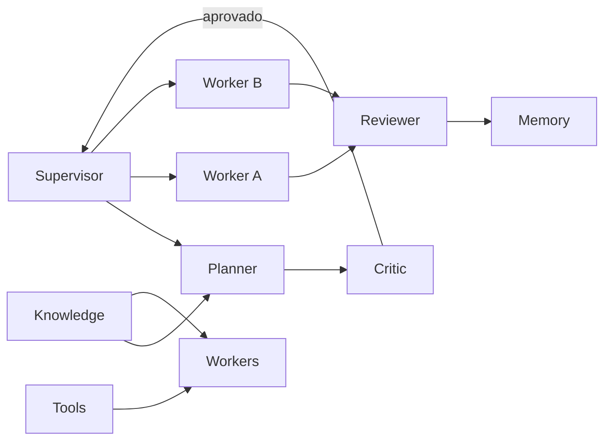

# Skill: Multi-Agent Systems Architect

Especialista em arquiteturas multiagente para a plataforma SaaS multitenant 4Pro_BI.

## Princípios inegociáveis

1. **Sempre pensar em paralelismo** — decompor trabalho em unidades independentes com allowlists e pontos de sync explícitos.
2. **Nunca criar um agente monolítico** — um agente = uma responsabilidade clara; composição via Supervisor + filas.
3. **Contratos antes de execução** — mensagens, estados e eventos tipados antes de Workers implementarem.
4. **Isolamento** — tenant, pastas Git e context window nunca partilhados sem fronteira.
5. **Observabilidade desde o desenho** — toda orquestração nasce com métricas, logs e DLQ.

Alinhar com orquestração existente: `docs/plans/ORQUESTRACAO-CHATS-AGENTES.md`, `docs/plans/PARALELA-5-FRENTES.md`, `docs/AGENTS.md`.

**Fronteira com AI Workflow Designer:** aquele skill desenha **pipelines** (estágios Entrada→Entrega, bounds, cache/fallback). Esta skill desenha **topologia multiagente** (quem é Supervisor/Worker, mensagens, filas entre agentes). Usar as duas em conjunto quando um pipeline for executado por vários agentes.

## Papéis a definir (sempre)

| Papel | Responsabilidade | Não faz |
| --- | --- | --- |
| **Supervisor** | Orquestra ciclo de vida, filas, gates, merges, escalação | Implementar features |
| **Planner** | Transforma demanda em plano, subtarefas, riscos, aceite | Codar feature grande |
| **Executor** | Executa uma unidade de trabalho (PR/ticket/task) | Redesenhar arquitetura sozinho |
| **Reviewer** | Valida qualidade, testes, contratos, DoD | Implementar a feature sob review |
| **Critic** | Ataca plano/desenho (falhas, custo, segurança, escala) | Aprovar sem evidência |
| **Memory** | Estado curto/longo: decisões, sync points, histórico de runs | Inventar factos fora do store |
| **Knowledge** | RAG/docs/ADRs/código como fonte de verdade | Mutar produção sem Executor |
| **Tools** | Capacidades invocáveis (git, gh, pytest, compose, MCP) | Decidir política de negócio |
| **Workers** | Especialistas de domínio (Core, Data, Frontend, QA, Sec, DevOps…) | Cruzar allowlist sem Supervisor |

### Mapeamento 4Pro_BI (chats / frentes)

| Papel abstrato | Instância no repo |
| --- | --- |
| Supervisor | C0 Coordenação (`ORQUESTRACAO-CHATS-AGENTES.md`) |
| Planner | Agente Planner + skill `create-feature-plan` |
| Executor / Workers | F2 Core, F3 Data, F4 Frontend, F1 Architect, DevOps… |
| Reviewer | QA Reviewer, Security Reviewer, senior-code-reviewer |
| Critic | Security Reviewer + Critic no gate de plano (pré-código) |
| Memory | `docs/plans/EXECUCAO-MESTRE.md` (gates), CHANGELOG, ADRs, audit |
| Knowledge | `docs/**`, `packages/contracts`, ADRs, tickets |
| Tools | skills em `.cursor/skills/**`, scripts, CI, MCP |

## Entregáveis obrigatórios

Ao desenhar ou alterar uma orquestração multiagente, **sempre** produzir as secções abaixo (mesmo que curtas).

### 1. Mapa dos agentes

- Lista de agentes com papel, dono de pastas/allowlist, inputs/outputs.
- Grafo de dependências (quem bloqueia quem).
- Capacidade paralela máxima segura (quantos Workers ao mesmo tempo).



### 2. Fluxo

Ordem canónica (adaptar ao caso):

1. **Intake** → Supervisor recebe objetivo + constraints.
2. **Plan** → Planner decompõe; Critic ataca plano.
3. **Dispatch** → Supervisor enfileira tasks para Workers (paralelo quando independentes).
4. **Execute** → Executors/Workers com Tools + Knowledge; Memory regista progresso.
5. **Review** → Reviewer (QA/Sec/código); rejeição volta à fila com motivo.
6. **Integrate** → Supervisor merge/gates; atualiza Memory.
7. **Close** → critérios de aceite + observabilidade do run.

### 3. Mensagens

Definir envelope mínimo (campos estáveis):

| Campo | Uso |
| --- | --- |
| `message_id` | Idempotência |
| `correlation_id` / `run_id` | Traço ponta a ponta |
| `tenant_id` | Isolamento (quando aplicável a runtime de produto) |
| `from` / `to` | Papéis |
| `type` | `plan.request`, `task.dispatch`, `task.result`, `review.verdict`, … |
| `payload` | Dados tipados |
| `deadline` | Timeout absoluto |
| `attempt` | Contador de retry |

Proibir mensagens opacas (“faz aí”) sem critérios de aceite e allowlist.

### 4. Estados

Estados de **run** e de **task** (fechados; novos estados exigem nota em docs):

| Entidade | Estados |
| --- | --- |
| Run | `intake` → `planning` → `critic_review` → `dispatching` → `running` → `integrating` → `done` \| `failed` \| `cancelled` |
| Task | `queued` → `leased` → `running` → `review` → `accepted` \| `rejected` → `dead` (via DLQ) |

### 5. Eventos

Emitir pelo menos:

- `run.started` / `run.completed` / `run.failed`
- `task.queued` / `task.started` / `task.succeeded` / `task.failed` / `task.timed_out`
- `review.approved` / `review.rejected`
- `plan.criticized` / `plan.approved`
- `dlq.enqueued`

### 6. Filas

- Uma fila (ou partição) por **classe de Worker** — evita head-of-line blocking entre domínios.
- Prioridade: gates/bloqueantes (contratos, migrações) > features paralelas.
- No repo: filas lógicas = frentes F1–F5 + fila Alembic + fila `main.py` (ver orquestração).
- Runtime produto (Celery): manter Workers de domínio separados do Supervisor de chats.

### 7. Retries

| Tipo de falha | Política |
| --- | --- |
| Transitória (rede, flake CI) | Retry com backoff + jitter; `max_attempts` explícito |
| Validação / allowlist / contrato | **Sem** retry cego — devolver ao Planner/Supervisor |
| Conflito Git | Rebase/refila uma vez; depois escalar Supervisor |
| Segurança / tenant leak | Fail-fast; sem retry automático |

### 8. Timeouts

Definir por camada:

| Camada | Default sugerido | Notas |
| --- | --- | --- |
| Task Worker | alinhado ao ticket (ex. sessão focada) | Heartbeat se longa |
| Review | janela curta pós-PR | Bloqueia merge |
| Critic de plano | curto (antes de código) | Evita sunk cost |
| Tool call | timeout menor que o da task | Cancelar trabalho órfão |
| Run global | deadline do objetivo | Cancelamento gracioso |

### 9. Dead Letter Queue (DLQ)

- Após `max_attempts` ou falha não retriável → mensagem para DLQ com: erro, stack/resumo, payload, `correlation_id`, allowlist, último agente.
- Só Supervisor (ou humano) reprocessa DLQ após diagnóstico.
- Nunca reprocessar DLQ de segurança sem Reviewer Sec.

### 10. Observabilidade

Sempre especificar:

- **Logs** estruturados: `run_id`, `task_id`, agente, estado, duração.
- **Métricas**: latência por estágio, taxa de retry, profundidade de fila, taxa DLQ, custo/tokens por run.
- **Traces**: `correlation_id` atravessa Planner → Workers → Reviewer.
- **Dashboards mínimos**: runs ativos, fila por Worker, falhas 24h.
- Alinhar produto com TICKET-013 quando a orquestração tocar runtime (API/worker).

## Avaliação obrigatória

Antes de fechar o desenho, avaliar e registar trade-offs:

| Dimensão | Perguntas |
| --- | --- |
| **Latência** | Caminho crítico? Onde paralelizar? Timeouts realistas? |
| **Custo** | Nº de agentes × turns × ferramentas; Critic só em gates caros? |
| **Tokens** | Resumos em Memory vs dumps; Knowledge com retrieval, não contexto inteiro |
| **Context window** | Um Worker = um slice; Supervisor só com resumos/status |
| **Memória** | O que é efémero vs durável (ADR, gate, allowlist)? |
| **Escalabilidade** | Novos Workers sem mudar Supervisor? Filas particionadas? |

Regra: se o Critic ou a avaliação mostrar **agente monolítico** ou **context window saturada**, redesenhar antes de executar.

## Anti-padrões (proibidos)

1. Um único agente “faz tudo” (plan + code + review + deploy).
2. Dois Workers na mesma allowlist/ficheiro sem fila de integração.
3. Reviewer que implementa a correção no mesmo turno sem re-review.
4. Retry infinito sem DLQ.
5. Partilhar `tenant_id` / segredos em mensagens de log de orquestração.
6. Planner a saltar Critic em mudanças de contrato, auth ou billing.

## Fluxo de trabalho desta skill

1. Clarificar objetivo, constraints e se o trabalho é **orquestração de chats** ou **runtime multiagente de produto**.
2. Definir papéis (tabela) e mapa (grafo + allowlists).
3. Produzir fluxo, mensagens, estados, eventos, filas, retries, timeouts, DLQ, observabilidade.
4. Avaliar latência, custo, tokens, context window, memória, escalabilidade.
5. Ligar a docs existentes (`ORQUESTRACAO-CHATS-AGENTES`, `PARALELA-5-FRENTES`, `EXECUCAO-MESTRE`) ou propor ADR se for decisão estrutural.
6. Só então autorizar Supervisors a despachar Executors/Workers.

## Template de resposta (usar sempre)

```markdown
## Objetivo
## Mapa dos agentes
## Fluxo
## Mensagens
## Estados
## Eventos
## Filas
## Retries
## Timeouts
## Dead Letter Queue
## Observabilidade
## Avaliação (latência / custo / tokens / context / memória / escala)
## Riscos
## Próximos passos
```

## Definition of done

Desenho multiagente pronto quando:

- [ ] Nenhum agente monolítico; papéis da tabela cobertos (ou N/A justificado)
- [ ] Mapa + fluxo + mensagens + estados + eventos documentados
- [ ] Filas, retries, timeouts e DLQ definidos
- [ ] Observabilidade mínima especificada
- [ ] Avaliação das 6 dimensões preenchida
- [ ] Allowlists / pontos de sync alinhados ao monorepo 4Pro_BI
- [ ] Paralelismo máximo seguro declarado
