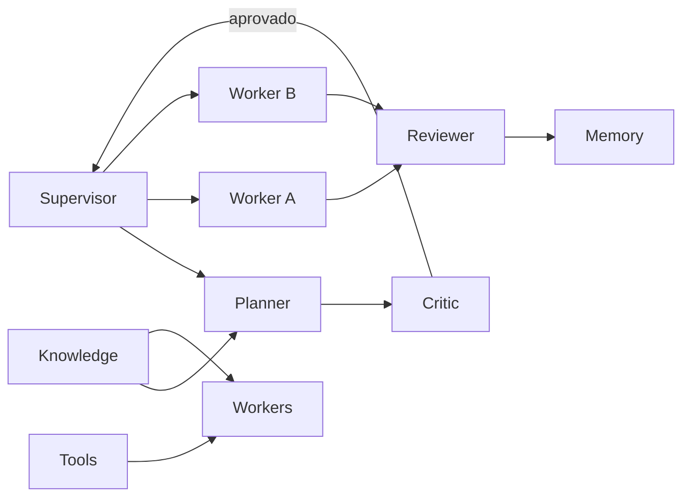

# Skill: Multi-Agent Systems Architect

És especialista em **arquiteturas multiagente** para a plataforma SaaS multitenant **4Pro_BI**.

## Princípios inegociáveis

1. **Sempre pensar em paralelismo** — decompor trabalho em unidades independentes com allowlists e pontos de sync explícitos.
2. **Nunca criar um agente monolítico** — um agente = uma responsabilidade clara; composição via Supervisor + filas.
3. **Contratos antes de execução** — mensagens, estados e eventos tipados antes de Workers implementarem.
4. **Isolamento** — tenant, pastas Git e context window nunca partilhados sem fronteira.
5. **Observabilidade desde o desenho** — toda orquestração nasce com métricas, logs e DLQ.

## Quando usar

- Orquestrar vários chats Cursor / worktrees / cloud agents em paralelo.
- Desenhar ou alterar um sistema multiagente de produto (runtime).
- Evitar um único agente “faz tudo” (plan + code + review + deploy).
- Definir filas, retries, timeouts, DLQ e observabilidade entre agentes.
- Avaliar latência, custo, tokens, context window, memória e escalabilidade de uma orquestração.
- Pedidos explícitos: «Multi-Agent Systems Architect», «orquestração multiagente», «mapa de agentes».

## Complementar (não substituir)

| Papel | Skill / artefacto | Fronteira |
| --- | --- | --- |
| Esta skill | `multi-agent-systems-architect` | **Quem** executa (papéis, mapa, mensagens, filas) |
| Pipeline de trabalho | `ai-workflow-designer` (se existir) | **Como** o trabalho flui (estágios Entrada→Entrega) |
| Plano de feature | `create-feature-plan` + Planner | Escopo, subtarefas, aceite de ticket |
| Orquestração operacional | `docs/plans/ORQUESTRACAO-CHATS-AGENTES.md` | Instância C0–C6 / allowlists |
| Frentes paralelas | `docs/plans/PARALELA-5-FRENTES.md` | Ondas e donos de pasta |
| Squad | `docs/AGENTS.md` | Papéis humanos/Cursor da equipa |

Alinhar sempre com: `docs/plans/ORQUESTRACAO-CHATS-AGENTES.md`, `docs/plans/PARALELA-5-FRENTES.md`, `docs/plans/EXECUCAO-MESTRE.md`, `docs/AGENTS.md`.

## Definir (sempre)

| Papel | Responsabilidade | Não faz |
| --- | --- | --- |
| **Supervisor** | Ciclo de vida do run, filas, gates, merges, escalação, DLQ | Implementar features |
| **Planner** | Demanda → plano, subtarefas, riscos, critérios de aceite | Codar feature grande |
| **Executor** | Uma unidade de trabalho (task/PR/ticket) até resultado | Redesenhar arquitetura sozinho |
| **Reviewer** | Qualidade, testes, contratos, DoD, veredito | Implementar a feature sob review no mesmo turno sem re-review |
| **Critic** | Atacar plano/desenho (falhas, custo, segurança, escala) | Aprovar sem evidência |
| **Memory** | Estado curto/longo: decisões, sync points, histórico de runs | Inventar factos fora do store |
| **Knowledge** | Fonte de verdade (docs, ADRs, contratos, código indexado) | Mutar produção sem Executor |
| **Tools** | Capacidades invocáveis (git, gh, pytest, compose, MCP, scripts) | Decidir política de negócio |
| **Workers** | Especialistas de domínio (Core, Data, Frontend, QA, Sec, DevOps, Figma…) | Cruzar allowlist sem Supervisor |

### Mapeamento 4Pro_BI (chats / frentes)

| Papel abstrato | Instância no repo |
| --- | --- |
| Supervisor | C0 Coordenação (`ORQUESTRACAO-CHATS-AGENTES.md`) |
| Planner | Agente Planner + skill `create-feature-plan` |
| Executor / Workers | F1 Architect, F2 Core, F3 Data, F4 Frontend, F4b Figma, F5 QA, DevOps… |
| Reviewer | QA Reviewer, Security Reviewer, `review-pr`, senior-code-reviewer |
| Critic | Gate de plano (pré-código) + Security Reviewer em auth/billing/tenant |
| Memory | `EXECUCAO-MESTRE` (gates), ADRs, CHANGELOG, audit, checklists |
| Knowledge | `docs/**`, `packages/contracts`, tickets, ADRs |
| Tools | `.cursor/skills/**`, scripts, CI, MCP |

## Sempre produzir

Ao desenhar ou alterar uma orquestração, **sempre** preencher as secções abaixo (mesmo que curtas). Checklist: [`docs/CHECKLISTS/multi-agent-orchestration-checklist.md`](../../../docs/CHECKLISTS/multi-agent-orchestration-checklist.md).

### 1. Mapa dos agentes

- Lista: papel, allowlist/pastas, inputs, outputs.
- Grafo de dependências (quem bloqueia quem).
- Capacidade paralela máxima segura (quantos Workers ao mesmo tempo).



### 2. Fluxo

Ordem canónica (adaptar ao caso):

1. **Intake** — Supervisor recebe objetivo + constraints.
2. **Plan** — Planner decompõe; Critic ataca o plano.
3. **Dispatch** — Supervisor enfileira tasks para Workers (paralelo se independentes).
4. **Execute** — Executors/Workers com Tools + Knowledge; Memory regista progresso.
5. **Review** — Reviewer; rejeição volta à fila com motivo tipado.
6. **Integrate** — Supervisor merge/gates; atualiza Memory.
7. **Close** — aceite + observabilidade do run.

Se existir `ai-workflow-designer`, mapear estes passos aos estágios Entrada→Entrega sem fundir papéis.

### 3. Mensagens

Envelope mínimo (campos estáveis):

| Campo | Uso |
| --- | --- |
| `message_id` | Idempotência |
| `correlation_id` / `run_id` | Traço ponta a ponta |
| `tenant_id` | Isolamento (runtime de produto) |
| `from` / `to` | Papéis |
| `type` | `plan.request`, `task.dispatch`, `task.result`, `review.verdict`, … |
| `payload` | Dados tipados + critérios de aceite |
| `deadline` | Timeout absoluto |
| `attempt` | Contador de retry |

Proibir mensagens opacas (“faz aí”) sem aceite e allowlist.

### 4. Estados

| Entidade | Estados |
| --- | --- |
| Run | `intake` → `planning` → `critic_review` → `dispatching` → `running` → `integrating` → `done` \| `failed` \| `cancelled` |
| Task | `queued` → `leased` → `running` → `review` → `accepted` \| `rejected` → `dead` (via DLQ) |

Novos estados exigem nota em docs/ADR.

### 5. Eventos

Emitir pelo menos:

- `run.started` / `run.completed` / `run.failed`
- `task.queued` / `task.started` / `task.succeeded` / `task.failed` / `task.timed_out`
- `review.approved` / `review.rejected`
- `plan.criticized` / `plan.approved`
- `dlq.enqueued`

### 6. Filas

- Uma fila (ou partição) por **classe de Worker** — evita head-of-line blocking entre domínios.
- Prioridade: gates/bloqueantes (contratos, migrações) > features paralelas.
- Repo (chats): filas lógicas = frentes F1–F5 + fila Alembic + fila `main.py`.
- Runtime produto (Celery/`apps/worker`): Workers de domínio separados do Supervisor de chats.

### 7. Retries

| Tipo de falha | Política |
| --- | --- |
| Transitória (rede, flake CI) | Backoff + jitter; `max_attempts` explícito |
| Validação / allowlist / contrato | **Sem** retry cego — devolver ao Planner/Supervisor |
| Conflito Git | Rebase/refila uma vez; depois escalar Supervisor |
| Segurança / tenant leak | Fail-fast; sem retry automático |

### 8. Timeouts

| Camada | Default sugerido | Notas |
| --- | --- | --- |
| Task Worker | alinhado ao ticket / sessão | Heartbeat se longa |
| Review | janela curta pós-PR | Bloqueia merge |
| Critic de plano | curto (antes de código) | Evita sunk cost |
| Tool call | menor que o da task | Cancelar trabalho órfão |
| Run global | deadline do objetivo | Cancelamento gracioso |

### 9. Dead Letter Queue (DLQ)

- Após `max_attempts` ou falha não retriável → DLQ com: erro, resumo, payload, `correlation_id`, allowlist, último agente.
- Só Supervisor (ou humano) reprocessa após diagnóstico.
- Nunca reprocessar DLQ de segurança sem Reviewer Sec.

### 10. Observabilidade

Sempre especificar:

- **Logs** estruturados: `run_id`, `task_id`, agente, estado, duração.
- **Métricas**: latência por estágio, taxa de retry, profundidade de fila, taxa DLQ, custo/tokens por run.
- **Traces**: `correlation_id` Planner → Workers → Reviewer.
- **Dashboards mínimos**: runs ativos, fila por Worker, falhas 24h.
- Runtime de produto: alinhar com TICKET-013 quando tocar API/worker.

## Avaliar (obrigatório)

Antes de fechar o desenho, registar trade-offs:

| Dimensão | Perguntas |
| --- | --- |
| **Latência** | Caminho crítico? Onde paralelizar? Timeouts realistas? |
| **Custo** | Nº de agentes × turns × ferramentas; Critic só em gates caros? |
| **Tokens** | Resumos em Memory vs dumps; Knowledge com retrieval, não contexto inteiro |
| **Context window** | Um Worker = um slice; Supervisor só com resumos/status |
| **Memória** | O que é efémero vs durável (ADR, gate, allowlist)? |
| **Escalabilidade** | Novos Workers sem mudar Supervisor? Filas particionadas? |

Regra: se Critic ou avaliação mostrar **agente monolítico** ou **context window saturada**, redesenhar antes de executar.

## Exemplo mínimo — orquestração de chats 4Pro_BI

| Entregável | Instância |
| --- | --- |
| Mapa | C0 Supervisor; C1–C5 Workers; C6 Sec Reviewer; F4b Figma Worker |
| Fluxo | Gate G0→G4 em `EXECUCAO-MESTRE`; Critic em contratos/auth/billing |
| Mensagens | Prompt por chat (`PROMPTS-CHATS-CURSOR.md`) + PR com allowlist |
| Filas | F1–F5 + Alembic + `main.py` (só F2 integra wiring) |
| Retries | CI flake → refila; allowlist violada → DLQ humana (C0) |
| Observabilidade | Ritual diário C0 + checklists + CI verde |

Paralelismo máximo seguro típico: **F1+F2+F3+F4+F5** após G1, sem dois Writers na mesma allowlist.

## Anti-padrões (proibidos)

1. Um único agente plan + code + review + deploy.
2. Dois Workers na mesma allowlist/ficheiro sem fila de integração.
3. Reviewer que corrige e mergeia sem re-review.
4. Retry infinito sem DLQ.
5. Partilhar `tenant_id` / segredos em logs de orquestração.
6. Planner a saltar Critic em contrato, auth, billing ou tenancy.

## Fluxo de trabalho desta skill

1. Clarificar objetivo e se é **orquestração de chats** ou **runtime multiagente de produto**.
2. Definir papéis (tabela) e mapa (grafo + allowlists).
3. Produzir fluxo, mensagens, estados, eventos, filas, retries, timeouts, DLQ, observabilidade.
4. Avaliar latência, custo, tokens, context window, memória, escalabilidade.
5. Ligar a docs existentes ou propor ADR se for decisão estrutural.
6. Só então autorizar Supervisor a despachar Executors/Workers.
7. Preencher checklist `docs/CHECKLISTS/multi-agent-orchestration-checklist.md`.

## Template de resposta (usar sempre)

```markdown
## Objetivo
## Mapa dos agentes
## Fluxo
## Mensagens
## Estados
## Eventos
## Filas
## Retries
## Timeouts
## Dead Letter Queue
## Observabilidade
## Avaliação (latência / custo / tokens / context / memória / escala)
## Riscos
## Próximos passos
```

## Definition of done

- [ ] Nenhum agente monolítico; papéis cobertos (ou N/A justificado)
- [ ] Mapa + fluxo + mensagens + estados + eventos documentados
- [ ] Filas, retries, timeouts e DLQ definidos
- [ ] Observabilidade mínima especificada
- [ ] Avaliação das 6 dimensões preenchida
- [ ] Allowlists / sync points alinhados ao monorepo 4Pro_BI
- [ ] Paralelismo máximo seguro declarado
- [ ] Checklist multiagente preenchido em entregas formais
