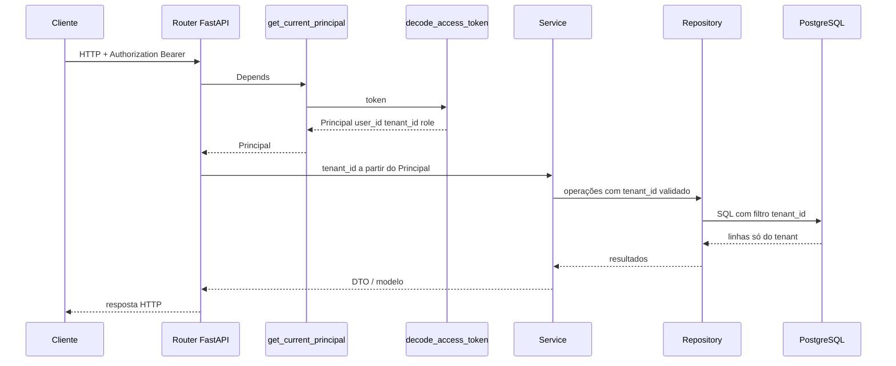

# Arquitetura

## Blocos

- **Web App** — `apps/web` (Angular 19): portal administrativo, workspace e upload (evolução).
- **API** — `apps/api` (FastAPI): identidade, tenancy, billing, ingestão, catálogo.
- **Worker** — `apps/worker` (Celery + Redis): parsing e jobs assíncronos.
- **PostgreSQL** — dados de aplicativo e, no futuro, camadas analíticas conforme ADR.
- **Redis** — broker/backend Celery e cache (evolução).
- **Armazenamento de objetos** — MinIO em `infra/compose` para stage de arquivos (upload).

## Pacotes

- `packages/contracts` — DTOs Pydantic compartilhados (`fourpro_contracts`): `auth`, `ingestion`, `dataset`, `tenant`, `billing` (contexto `/me/context` e limites de plano). Ver [docs/adr/000-contract-slices.md](./adr/000-contract-slices.md). **Edição deste pacote:** Frente Architect (gestão em [5 frentes paralelas](./plans/PARALELA-5-FRENTES.md)); impacto documentado aqui ou em ADR.
- `packages/ui` — biblioteca opcional de componentes partilhados do `apps/web` (ver `packages/ui/README.md`); evolução coordenada com a Frente Architect quando afectar contratos visuais ou tokens.
- `packages/shared` — utilitários comuns (API + worker).

## Domínios principais

- Identity & Access
- Tenancy
- Billing
- File Upload
- Ingestion
- Dataset Catalog
- Workspace
- Admin

## Backend Core vs Backend Data (quem expõe o quê)

A API é um único serviço FastAPI; a **equipa** divide responsabilidades para PRs e ownership de ficheiros ([5 frentes paralelas](./plans/PARALELA-5-FRENTES.md)). Em texto:

| Frente | Dono típico (HTTP / domínio) | Não é dono de |
|--------|------------------------------|---------------|
| **Backend Core (F2)** | `auth`, `me` (incl. contexto e uso de armazenamento), `tenant` (membros, grupos de quota, quotas por utilizador), serviços de billing chamados por outros módulos, `health` | Rotas de `uploads`, `ingestions`, `datasets`; `ingestion_repository`; jobs de parsing |
| **Backend Data (F3)** | `uploads`, `ingestions`, `datasets`, validação de conteúdo de ficheiro, filas/jobs de pipeline | `main.py` e agregação de routers (integração é PR **F2**); modelos Core (`user`, `tenant`, `plan`, …) |

**Contratos** (`fourpro_contracts`) são transversais: F1 define DTOs; F2/F3 **importam** e não duplicam shapes (ver [ADR 000](./adr/000-contract-slices.md)). O catálogo (`DatasetItem`) reflete apenas linhas **processadas**; o histórico de pipeline (`IngestionItem`) usa o conjunto fechado de estados `uploaded` → `validating` → `parsing` → `processed` | `failed`, tipado em `fourpro_contracts.ingestion` — novos estados exigem migração de dados + alteração F1 ao contrato e nota aqui ou em ADR.

## Estrutura da API (camadas)

- `routers/` — HTTP, validação de entrada, rate limits.
- `services/` — regras de negócio.
- `repositories/` — persistência.
- `models/` — SQLAlchemy.
- `core/` — segurança (hash, JWT).

Migrações: **Alembic** em `apps/api/alembic/`. Em contentor, o entrypoint corre `alembic upgrade head`; **`RUN_SEED`** controla se o seed de demo corre no arranque — em produção, após o primeiro bootstrap, usar `RUN_SEED=false` (modelo em `infra/portainer/.env.production.example`).

### Auditoria (`audit_log`)

- Tabela **append-only** para eventos sensíveis (auth, administração de tenant, etc.); a aplicação só **insere** linhas, sem updates/deletes via API.
- **Consulta / exportação:** `GET /api/v1/tenant/audit-log` — **só papel `admin`**, dados limitados ao `tenant_id` do JWT. Query opcional `since` (ISO 8601) para **poll incremental** (SIEM ou scripts): repetir pedidos com o último `created_at` processado. **CSV:** `GET /api/v1/tenant/audit-log/export.csv` com os mesmos critérios de isolamento; `max_rows` (1–10 000, default 5000); UTF-8 com BOM para folhas de cálculo; rate limit mais restritivo que a listagem JSON.
- **Paginação:** `limit` (1–200, default 50) e `offset`. Resposta inclui `since_applied` quando o filtro é usado.
- **Rate limit** dedicado na rota (slowapi) para evitar abuso de leitura.
- **Refresh token / proxy:** o limite de `POST /auth/refresh` é configurável por ambiente (`REFRESH_RATE_LIMIT`, ex. `120/minute`) para afinar quando muitos clientes partilham o mesmo IP visto pela API.
- **IP real para rate limit:** com `RATE_LIMIT_TRUST_PROXY=true`, a chave slowapi usa o endereço mais à esquerda de `X-Forwarded-For`. Activar **só** com reverse proxy de confiança que não propague `X-Forwarded-For` controlado pelo cliente sem validação. Caso contrário, manter `false` (default). Em Portainer, o serviço `api` em `infra/portainer/stack-4pro-bi.yml` expõe `REFRESH_RATE_LIMIT` e `RATE_LIMIT_TRUST_PROXY` via substituição de variáveis do ficheiro `infra/portainer/.env`.
- **UI:** no portal web, administradores acedem a **Auditoria** no menu (rota `/app/tenant-audit`), com paginação, filtro opcional `since` alinhado à API e botão **Exportar CSV** (respeita o filtro activo).

### Cotas de armazenamento em disco (tenant, utilizador, grupo)

O produto aplica **três níveis** de limite sobre o total de bytes persistidos em `file_ingestions` (soma de `size_bytes` por escopo). Todos são verificados no **upload** (`POST /uploads`) via `BillingService.ensure_storage_for_new_upload`, depois da contagem mensal de ficheiros e antes da validação de conteúdo. Respostas de quota esgotada: **HTTP 402** com mensagem distinta por nível (tenant / utilizador / grupo).

| Nível | Origem do limite | O que entra na soma |
|--------|------------------|---------------------|
| **Tenant** | Plano activo (`plans.max_storage_mb` via `tenant_subscriptions`) | Todas as ingestões do `tenant_id`. |
| **Utilizador** | Opcional: `tenant_memberships.max_storage_mb` (NULL = sem teto extra neste nível) | Ingestões com `uploaded_by_user_id` = utilizador no tenant. `0` MB significa sem espaço permitido para esse utilizador. |
| **Grupo** | Tabela `tenant_quota_groups` (`max_storage_mb` por grupo no tenant); membros referenciam o grupo em `tenant_memberships.quota_group_id` | Agregado de todas as ingestões carregadas por utilizadores que pertencem ao mesmo grupo **nesse tenant**. |

**Administração (JWT com papel `admin` no tenant):**

- `GET/POST/PATCH/DELETE /api/v1/tenant/quota-groups` — CRUD de grupos.
- `PATCH /api/v1/tenant/members/{user_id}/quotas` — corpo parcial (`exclude_unset`): `max_storage_mb` e/ou `quota_group_id` (UUID ou `null` para remover).

**Contrato:** `GET /api/v1/me/context` inclui `storage` (`StorageContext` em `fourpro_contracts.billing`): bytes usados vs limites conhecidos no tenant, no utilizador e no grupo (quando aplicável). A listagem `GET /tenant/members` expõe `max_storage_mb`, `quota_group_id` e `quota_group_name` por membro.

**Migrações:** alterações de schema Core destas tabelas usam revisões Alembic com prefixo `core__` no nome do ficheiro (ex.: `core__…_storage_quotas.py`). Índices de dados de ingestão continuam com prefixo `data__` quando aplicável.

**Impacto:** qualquer cliente (web, integrações) que consuma `/me/context` deve tolerar o campo opcional `storage`; UI de gestão de quotas é evolução da Frente Frontend.

**Operação:** em deploy com contentores, o entrypoint da API aplica migrações ao arranque; rebuild da imagem incorpora `packages/contracts`. Detalhes e checklist staging/produção: `infra/portainer/README.md` (secção *Migrações e pacote contracts*); migração manual só com Postgres local: `scripts/run-db-migrate.sh`. Paridade com o CI (Postgres vazio + cadeia Alembic): `scripts/run-alembic-postgres-local.sh` (Docker).

## Regra central

Nada cruza **tenant** sem autorização explícita e validada no backend. O **tenant ativo** da request vem do contexto de autenticação (ver secção seguinte), não de parâmetros não confiáveis do cliente.

## Multitenancy — fundação (TICKET-004)

### Objetivo

Garantir que cada utilizador autenticado opera apenas sobre dados do **tenant** ao qual pertence, com modelo de dados explícito, contratos estáveis e padrão único no backend (API e worker).

### Modelo de dados mínimo

| Artefacto | Função |
|-----------|--------|
| **`tenants`** | Organização lógica (ex.: `id`, `slug`, `name`, timestamps). |
| **Vínculo utilizador ↔ tenant** | Tabela de associação (no código: `tenant_memberships`) com `user_id`, `tenant_id` e `role` (string inicial; matriz fina em TICKET-005). |

Requisito: toda tabela que armazena **dados de cliente** por tenant inclui **`tenant_id`** (FK para `tenants`), salvo excepções documentadas (ex.: tabelas só de plataforma).

### Isolamento — regras obrigatórias

1. **Fonte do tenant ativo** — O `tenant_id` efectivo da request é obtido **após** validar JWT/sessão (claims ou resolução no login), alinhado ao vínculo `user`↔`tenant`. Não confiar em `tenant_id` vindo só de body, query ou cabeçalho customizado sem revalidar membership.
2. **Contexto de request** — Objeto imutável de identidade + tenant (ex.: `Principal`: `user_id`, `tenant_id`, `role`) injectado via dependency FastAPI (`get_current_principal`) em rotas de negócio.
3. **Persistência** — Repositórios e queries **sempre** filtram por `tenant_id` do contexto validado; proibir listagens ou escritas “globais” acidentais em dados tenant-scoped.
4. **Serviços** — Regras de negócio recebem o tenant pelo contexto (ou parâmetro derivado exclusivamente dele), não por escolha arbitrária do cliente.
5. **Jobs assíncronos** — Mensagens/tasks carregam `tenant_id` (e identidade quando necessário); o worker aplica a mesma regra de filtro. A fila não substitui a validação na origem (enqueue só com tenant já validado na API).
6. **Troca de tenant** — Se existir selecção de tenant na UI, a operação passa por endpoint dedicado que verifica membership e emite novo token ou sessão; preferir audit log para eventos sensíveis (evolução).

### Fluxo — request autenticada até à persistência

### Contratos (`packages/contracts` e API)

- **Auth / sessão** — Respostas de token expõem `tenant_id`, `tenant_name` e `role` quando o login fixa o contexto (ex.: `TokenResponse` em `fourpro_contracts.auth` com `token_type` fixo `bearer`), para o cliente sincronizar estado sem enviar tenant “à parte” como verdade absoluta.
- **Recursos multi-tenant** — DTOs de domínio que representam entidades guardadas por tenant podem incluir `tenant_id` legível quando o contrato o exige (ex.: itens de catálogo/ingestão), mantendo consistência com OpenAPI e eventual geração de tipos no `apps/web`.
- **Contexto consolidado** — Endpoint de leitura do contexto do utilizador (ex.: `GET /me/context`) devolve tenant activo, metadados úteis, plano (`plan`) e uso de armazenamento (`storage`: tenant / utilizador / grupo quando definido), sempre derivados do backend a partir do principal autenticado.

Alterações a estes contratos exigem nota de **impacto** (cliente, versão de API, migrações).

### Impacto no backend (checklist para novas features)

| Camada | Expectativa |
|--------|-------------|
| **Routers** | Dependem de `Principal` (ou equivalente); não implementam isolamento só no frontend. |
| **Dependencies** | `get_current_principal` (e variantes `require_roles`) como porta de entrada. |
| **Core / segurança** | JWT (ou sessão) com claims mínimas para `user_id`, `tenant_id`, `role`; decodificação centralizada. |
| **Models** | `tenant_id` onde aplicável; FKs e índices para filtros frequentes. |
| **Repositories** | Métodos recebem `tenant_id` do contexto; testes cobrem negação de acesso cruzado. |
| **Services** | Orquestram com tenant do principal; validações de quota/limites por tenant quando existirem. |
| **Worker** | Consumo de jobs com `tenant_id` validado; mesmos padrões de repositório. |

### QA e riscos

- **Critério de aceite:** utilizador do tenant A não lê nem altera dados do tenant B (testes automatizados com seeds multi-tenant).
- **Risco principal:** vazamento por query sem filtro — mitigação: review, padrão de repositório base opcional, listas de verificação em `docs/CHECKLISTS` quando aplicável.

### Evolução

- **TICKET-005** — RBAC e papéis além do campo `role` string na membership.
- **Billing** — Limites por plano aplicados no contexto do `tenant_id` (ex.: TICKET-010): uploads mensais e armazenamento total do tenant; quotas opcionais por utilizador e por grupo documentadas na secção *Cotas de armazenamento em disco*.

## Aceleradores open-source e experiência unificada

O produto pode incorporar **capacidades open-source** (motores analíticos, armazenamento compatível com APIs padrão, filas, bibliotecas de parsing, etc.) para ganhar velocidade de entrega. **Requisito transversal:** na **superfície que o cliente vê** (web, exports, mensagens de erro, URLs do browser, documentação de utilizador), **não aparecem nomes, marcas, “powered by”, logos ou links para projetos externos** — tudo é apresentado como parte da solução 4Pro_BI.

### Padrões de integração (para equipa de implementação)

1. **Transporte e URL** — capacidades expostas via HTTP passam pelo **mesmo domínio** da app (reverse proxy / API gateway / BFF), com caminhos sob o prefixo da aplicação (ex.: `/app/...`, `/api/v1/...`). Evitar redirecionamentos para domínios de terceiros na jornada do utilizador.
2. **Autenticação** — troca de credenciais e emissão de sessão **na nossa API**; tokens de convidado ou equivalentes gerados pelo backend e com tempo de vida curto, **nunca** pedir ao utilizador final credenciais num “segundo login” de outro produto.
3. **UI embedável** — quando existir iframe ou módulo incorporado: tema, tipografia e cores alinhados ao **design system** do `apps/web`; desativar ou ocultar **cromo de produto** (menus de sistema, rodapés de projeto, links de ajuda genéricos) conforme permitido por configuração ou fork mínimo **mantido internamente** — sem expor essa origem ao utilizador.
4. **Bibliotecas em processo** — uso como dependência Python/TS/npm no repositório: sem exportar ao cliente stack traces com namespaces de pacotes reconhecíveis em produção; logs técnicos completos ficam no servidor.
5. **Observabilidade** — métricas e tracing podem usar stacks standard internamente; dashboards operacionais são **internos**, não parte do portal do cliente.

### Onde documentar nomes técnicos

Nomes concretos de projetos OSS usados no **build** e **ops** ficam em ADRs internos, `infra/README`, manifestos e comentários de código quando necessário — **não** em strings i18n, tooltips, emails transacionais nem PDFs entregues ao cliente.

### Diagramas e evidências visuais

Política de geração e armazenamento de imagens para documentação (Mermaid, exports, captures, vs runtime): ver [`docs/assets/README.md`](./assets/README.md).

## Decisões em aberto (ADR futuro)

- Quais **famílias** de componente entram (identidade federada, motor de relatórios, orquestração de transformações, etc.) versus implementação só no monorepo — ver `docs/wireframes/REFERENCIAS-MATERIAIS-LEGADOS.md` como histórico de opções; cada escolha concreta deve referenciar esta secção e cumprir **experiência unificada** acima.
