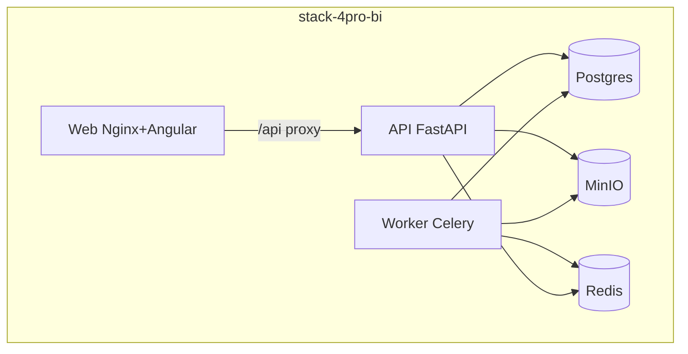

# Guia de deploy — 4Pro_BI

## O que faz

Descreve como colocar a plataforma em execução com Docker Compose / Portainer: Postgres, Redis, MinIO, API, Worker e Web, incluindo migrações, seed e checklist pós-deploy.

## Como funciona



- Entrypoint da API: `alembic upgrade head` → seed opcional (`RUN_SEED`) → Uvicorn.
- Worker consome fila Redis e processa ingestões.
- Web serve UI e faz proxy para a API.

Fonte Compose: `infra/portainer/stack-4pro-bi.yml`.

## Como instalar (deploy)

### Opção A — scripts na máquina com Docker

```bash
cd /opt/4Pro_BI   # ou clone do monorepo
cp -n infra/portainer/.env.production.example infra/portainer/.env
# editar JWT_SECRET, MINIO_ROOT_PASSWORD, RUN_SEED, portas
./scripts/stack-up.sh
# equivalente: make stack-up
```

### Opção B — Portainer UI

1. Clonar o **repo completo** (build precisa de `apps/` + `packages/`).
2. Stacks → Add stack → Compose path `infra/portainer/stack-4pro-bi.yml`.
3. Carregar env (`infra/portainer/.env`).
4. Deploy / Redeploy com rebuild quando código ou contracts mudarem.

Detalhes: [`infra/portainer/README.md`](../infra/portainer/README.md).

### Reset / rebuild (sem apagar volumes)

```bash
cd infra/portainer
docker compose -f stack-4pro-bi.yml --env-file .env down
docker compose -f stack-4pro-bi.yml --env-file .env up -d --build
```

Só limpar dados se pedido explicitamente (`STACK_DOWN_VOLUMES=1` ou `down -v`).

## Como configurar

| Variável | Produção |
|----------|----------|
| `JWT_SECRET` | Obrigatório; aleatório longo |
| `MINIO_ROOT_PASSWORD` | Obrigatório |
| `RUN_SEED` | `true` só no bootstrap; depois `false` |
| `RATE_LIMIT_TRUST_PROXY` | `true` só atrás de proxy de confiança e API não pública |
| `REFRESH_RATE_LIMIT` | Ajustar se muitos clientes partilham IP |
| `CORS_ORIGINS` | Origens reais do portal |
| `SMTP_*` / `APP_PUBLIC_URL` | MFA e reset de senha |

Modelo: `infra/portainer/.env.production.example`.

## Como testar

Após deploy:

```bash
./scripts/stack-ps.sh
curl -sS "http://localhost:${API_PUBLISH:-6418}/api/v1/health"
curl -sS "http://localhost:${API_PUBLISH:-6418}/api/v1/health/ready"
# UI: http://localhost:${WEB_PUBLISH:-8081}
```

E2E contra stack (se configurado):

```bash
./scripts/run-e2e-stack-browser.sh
```

Checklist: `docs/CHECKLISTS/qa-checklist.md`.

## Como evoluir

1. Alteração de schema → migração Alembic (`core__*` / `data__*`) + rebuild imagens `api` e `worker`.
2. Alteração de `packages/contracts` → rebuild obrigatório.
3. Expor ou não `/docs` (Swagger) em produção — preferir desligado na edge pública.
4. Documentar mudança de portas/variáveis neste guia e no Portainer README.
5. Decisões de runtime Desktop / BI avançado → ADRs (ver `docs/adr/`).
