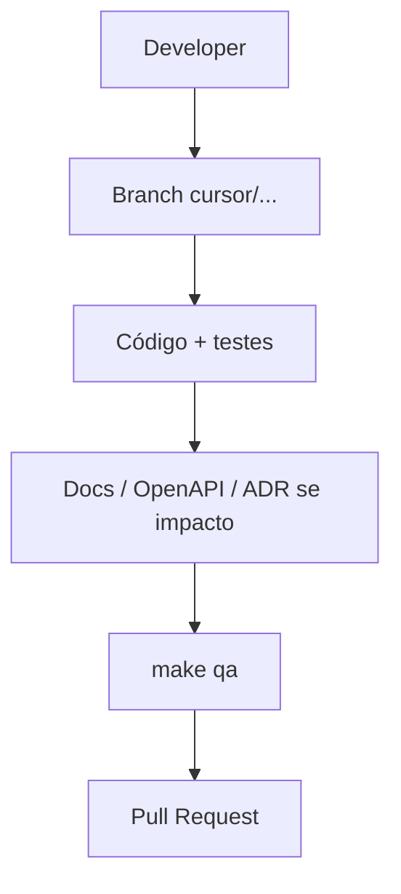

# Guia de desenvolvimento — 4Pro_BI

## O que faz

Define como desenvolver no monorepo: ownership por frentes, fluxo de trabalho local, testes, contratos, migrações e documentação obrigatória.

## Como funciona

Monorepo:

| Path | Responsabilidade |
|------|------------------|
| `apps/api` | FastAPI — Core + Data (routers separados) |
| `apps/worker` | Celery — parsing / jobs |
| `apps/web` | Angular 19 |
| `packages/contracts` | DTOs Pydantic partilhados |
| `packages/shared` | Utilitários |
| `infra/` | Compose, Portainer, Docker |
| `docs/` | Documentação canónica |
| `e2e/` | Playwright |

Ownership e prompts: `docs/plans/PARALELA-5-FRENTES.md`, `docs/AGENTS.md`.  
Arquitectura: `docs/ARCHITECTURE.md`.  
Contribuição GitHub: `CONTRIBUTING.md`.



## Como instalar

Seguir [INSTALLATION.md](./INSTALLATION.md). Resumo:

```bash
cp -n .env.example .env
python3 -m venv .venv && source .venv/bin/activate
pip install -r requirements-dev.txt
cd infra/compose && docker compose up -d postgres redis
cd ../../apps/api && alembic upgrade head && python -m fourpro_api.dev_seed
```

Web: `cd apps/web && npm ci && npm start`.

## Como configurar

- `.env` na raiz (nunca commitar segredos reais).
- Front: ambientes em `apps/web` (proxy/API URL conforme README da app).
- Pre-commit opcional: `pip install pre-commit && pre-commit install`.
- E2E: `e2e/.env.e2e` a partir de `e2e/.env.e2e.example`.

## Como testar

| Objectivo | Comando |
|-----------|---------|
| Unitários API | `cd apps/api && pytest -q` |
| Gates ≈ CI | `make qa` |
| Alembic em Postgres Docker | `make alembic-pg-local` |
| Smoke API Playwright | `make e2e-api-local` |
| Regenerar OpenAPI | `./scripts/export-openapi.sh` |

Regras:

- Isolamento de tenant em testes de dados/API.
- Papéis (`admin` / `analyst` / viewer) conforme RBAC das rotas.
- Checklists em `docs/CHECKLISTS/`.

## Como evoluir

1. **Feature grande** → plano (`create-feature-plan` / ticket em `tickets/` + plano em `docs/plans/`).
2. **Contratos** → editar só em `packages/contracts`; documentar impacto; regenerar OpenAPI.
3. **Migrações** → prefixo `core__` ou `data__`; uma única head Alembic.
4. **Documentação** — obrigatória (ADR-004):
   - actualizar guia/domínio afectado
   - diagramas Mermaid se o fluxo mudar (`docs/diagrams/`)
   - exemplos se a API pública mudar (`docs/examples/`)
   - entrada em `CHANGELOG.md`
5. **PRs pequenos** e revisáveis; template em `.github/pull_request_template.md`.

### Definition of Done (documentação)

Ver [`CHECKLISTS/documentation-checklist.md`](./CHECKLISTS/documentation-checklist.md) e ADR [`004`](./adr/004-documentation-standards.md).
