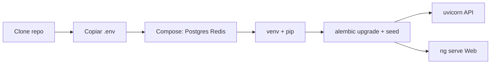

# Guia de instalação — 4Pro_BI

## O que faz

Instala e sobe o ambiente de desenvolvimento local: Postgres, Redis (opcional para worker), API FastAPI, frontend Angular e seed de demo.

## Como funciona



Componentes mínimos para UI + API: **Postgres** + **API** + **Web**.  
Worker/Celery + Redis são necessários para parsing assíncrono completo.

## Como instalar

### Pré-requisitos

- Git, Docker + Docker Compose
- Python **3.12+**
- Node.js **20+** (Angular 19 em `apps/web`)
- Opcional: `make`, `pre-commit`

### Caminho rápido (recomendado)

```bash
git clone <url-do-repo> 4Pro_BI && cd 4Pro_BI
cp -n .env.example .env
./scripts/dev-local.sh
```

O script sobe infra e indica comandos para API (`API_PUBLISH`, default **7418**) e `ng serve` (**4200**).

### Caminho manual

1. **Infra**

```bash
cd infra/compose && docker compose up -d postgres redis
```

2. **Python**

```bash
python3 -m venv .venv && source .venv/bin/activate
pip install -r requirements-dev.txt
```

3. **Migrações e seed**

```bash
set -a && source .env && set +a
cd apps/api && alembic upgrade head && python -m fourpro_api.dev_seed
```

4. **API**

```bash
cd apps/api && uvicorn fourpro_api.main:app --reload --port 7418
```

5. **Web**

```bash
cd apps/web && npm ci && npm start
```

Credenciais de demo (seed): ver saída do seed / `.env` — tipicamente `admin@local.dev` / `changeme`.

### Stack completa (contentores)

Ver [DEPLOYMENT.md](./DEPLOYMENT.md) e `infra/portainer/README.md` (`./scripts/stack-up.sh`).

## Como configurar

| Variável | Uso |
|----------|-----|
| `DATABASE_URL` | Postgres (porta host default **15432**) |
| `JWT_SECRET` | Obrigatório; valor longo em produção |
| `REDIS_URL` | Broker Celery |
| `UPLOAD_DIR` / `MAX_UPLOAD_MB` | Armazenamento de uploads |
| `CORS_ORIGINS` | Origens do front |
| `API_PUBLISH` / `WEB_PUBLISH` | Portas publicadas |
| `SMTP_*` | Email real para MFA/reset; sem SMTP → logs em dev |

Fonte: [`.env.example`](../.env.example).

## Como testar

```bash
# API unitária (SQLite em memória)
cd apps/api && pytest -q

# Health
curl -sS http://localhost:7418/api/v1/health

# Gates locais ≈ CI
./scripts/run-qa-gates.sh   # ou make qa
```

Smoke com browser: `e2e/README.md` (requer `e2e/.env.e2e`).

## Como evoluir

- Novas dependências Python → `apps/api/pyproject.toml` / `requirements-dev.txt`.
- Novas variáveis → actualizar `.env.example` **e** este guia.
- Mudança de portas default → sincronizar README raiz, Portainer e E2E.
- Instalação em ambiente partilhado: preferir `./scripts/dev-local.sh` para evitar conflitos de portas clássicas.
