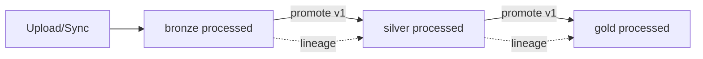

# ADR-004 — Camadas de governação bronze / silver / gold

**Estado:** aceite  
**Data:** 2026-07-25  
**Tickets:** TICKET-012

## Contexto

Após o pipeline de parsing (008) e o catálogo (009), o produto precisa de camadas lógicas e lineage mínimo sem introduzir warehouse externo prematuro.

## Decisão

1. **Onde vive cada camada (fase 1):** mesma base PostgreSQL + ficheiros no storage de upload; a camada é **metadado** em `file_ingestions.layer` (`bronze` | `silver` | `gold`).
2. **Transformações:** promoção controlada via API/worker (`POST /datasets/{id}/promote`) que cria **nova** ingestão `processed` na camada alvo, com `source_ingestion_id` e `transform_version` — sem SQL ad-hoc do cliente.
3. **Catálogo:** `GET /datasets?layer=` filtra; badge `layer` no DTO.
4. **Retenção (documentada):** bronze 90 dias recomendado; silver 365; gold até cancelamento do tenant — enforcement automático fica fora deste ADR (só política em `docs/SECURITY.md` / INGESTION).
5. **Ferramenta SQL versionada (dbt, etc.):** não obrigatória nesta fase.

## Fluxo

## Consequências

- Sem cruzamento de tenant na promoção (sempre `principal.tenant_id`).
- Falhas de promoção marcam a nova linha ou o job como `failed` com log técnico + mensagem amigável.
- Quotas de armazenamento (010) aplicam-se às cópias promovidas.
