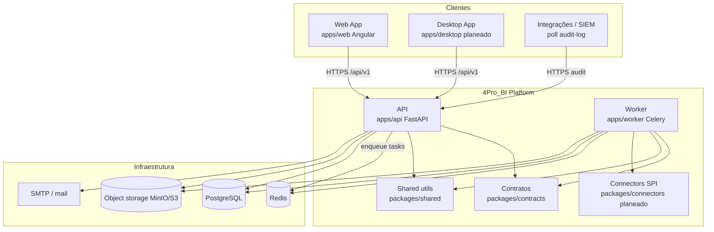
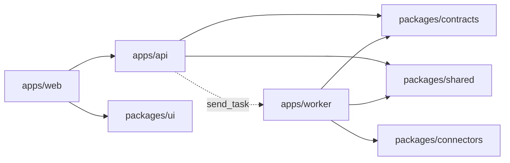
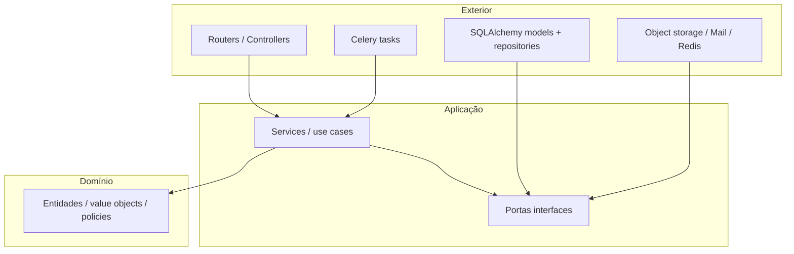
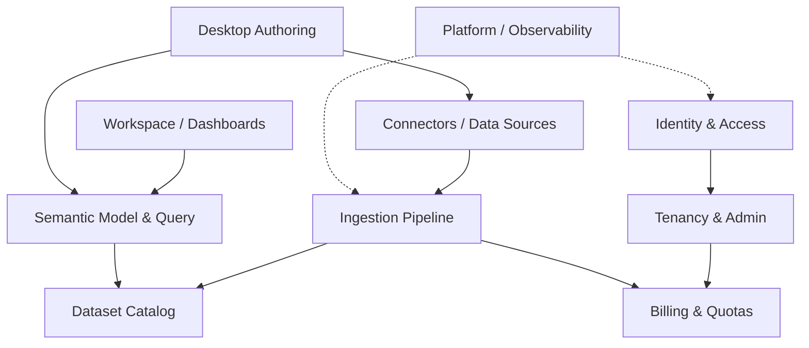
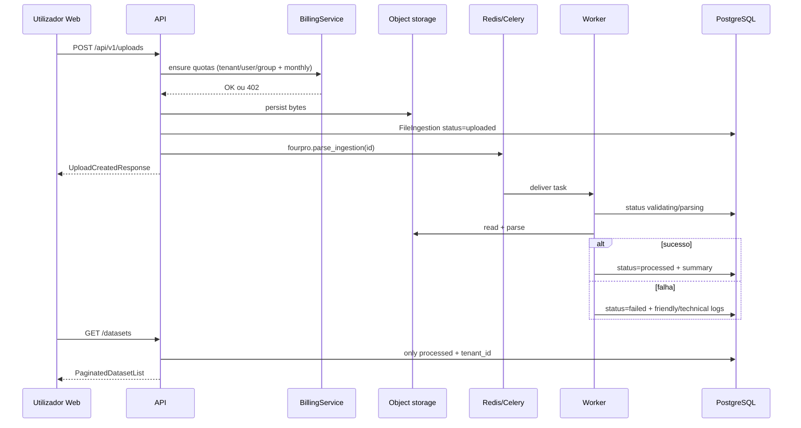

# Blueprint Arquitectónico — 4Pro_BI

**Estado:** aceite (fase base + programa BI planeado)  
**Owner:** Frente Architect  
**Última revisão:** 2026-07-25  
**ADRs relacionados:** [000](../adr/000-contract-slices.md) · [001](../adr/001-bi-platform-connectors-desktop-web.md) · [002](../adr/002-modular-monolith-clean-architecture.md)

---

## 1. Objectivo

Plataforma SaaS **multitenant** para ingerir dados (ficheiros e conectores), processar datasets, modelar métricas e autorar/consumir dashboards no **Web** e no **Desktop**, com cobrança por plano e experiência nativa **4Pro_BI**.

Este blueprint fixa:

- estrutura de pastas e camadas
- módulos e bounded contexts
- entidades e portas (interfaces)
- contratos, eventos, filas e APIs
- versionamento e regras de dependência
- trade-offs conscientes

**Princípio:** nenhum código de feature grande sem validar este documento + ADR aplicável.

---

## 2. Estilo arquitectónico

| Estilo | Aplicação |
|--------|-----------|
| **Modular monolith** | Um deploy de API FastAPI; módulos por bounded context com boundaries claros |
| **Clean Architecture (pragmática)** | `routers` → `services` → `repositories` / portas; domínio sem I/O |
| **DDD leve** | Bounded contexts + linguagem ubíqua; aggregates só onde há invariantes reais |
| **Event-driven (assíncrono)** | Jobs Celery como eventos de integração internos; outbox evolutivo |
| **Hexagonal nas bordas** | Object storage, mail, Redis, parsers atrás de adapters |

### Trade-off central

| Opção | Prós | Contras | Decisão |
|-------|------|---------|---------|
| Microserviços por contexto | Escala independente | Ops, latência, contratos distribuídos cedo demais | **Rejeitado** na fase actual |
| Modular monolith | Velocidade, ACID por feature, ownership por pasta | Risco de “big ball of mud” se boundaries falharem | **Aceite** (ADR-002) |
| Monólito anémico sem camadas | Entrega rápida | Acoplamento UI↔SQL, testes frágeis | **Rejeitado** |

---

## 3. Diagrama de contexto (C4 — System Context)



---

## 4. Diagrama de contentores (C4 — Containers)



Dependência **proibida:** `packages/contracts` → apps; `packages/shared` → apps; worker → routers FastAPI; web → SQLAlchemy/models.

---

## 5. Estrutura de pastas (canónica)

```text
/
├── apps/
│   ├── api/                      # Backend HTTP (modular monolith)
│   │   ├── alembic/              # Migrations versionadas
│   │   └── fourpro_api/
│   │       ├── routers/          # Adaptadores de entrada HTTP
│   │       ├── services/         # Casos de uso / domínio de aplicação
│   │       ├── repositories/     # Adaptadores de saída persistência
│   │       ├── models/           # ORM (infraestrutura)
│   │       ├── dependencies/     # Principal, RBAC, DI
│   │       ├── core/             # Segurança, primitives
│   │       ├── jobs/             # Orquestração local de jobs (sync/fallback)
│   │       ├── db/               # Session / Base
│   │       └── tasks_dispatch.py # Porta de publicação para fila
│   ├── worker/                   # Consumidores assíncronos
│   │   └── fourpro_worker/
│   │       ├── celery_app.py
│   │       └── tasks/            # Handlers por evento/job
│   ├── web/                      # Angular — apresentação
│   └── desktop/                  # Planeado (TICKET-017)
├── packages/
│   ├── contracts/                # DTOs Pydantic — fonte de verdade de payload
│   ├── shared/                   # Utils sem regra de negócio de produto
│   ├── connectors/               # SPI + plugins (TICKET-015)
│   └── ui/                       # Componentes partilhados Angular
├── infra/                        # compose, docker, portainer, scripts
├── docs/
│   ├── architecture/             # Este blueprint
│   ├── adr/                      # Decisões
│   └── plans/                    # Planos por ticket
├── tickets/                      # Cartões curtos
├── e2e/                          # Playwright
└── scripts/                      # Automação local / QA
```

### Evolução interna da API (módulos por contexto)

Quando um contexto crescer, preferir pastas por domínio **sem** partir o deploy:

```text
fourpro_api/
  identity/       # auth, mfa, reset, refresh
  tenancy/        # tenant, memberships, audit
  billing/        # plans, quotas, subscriptions
  ingestion/      # upload, lifecycle, reprocess
  catalog/        # datasets
  connectors/     # fontes (futuro)
  semantic/       # modelo + query (futuro)
  workspace/      # dashboards (futuro)
```

Até lá, a organização actual por camada (`routers/`, `services/`, …) é válida **se** cada ficheiro tiver ownership Core vs Data (ver `ARCHITECTURE.md`).

---

## 6. Camadas e regras de dependência (Clean Architecture)



### Regras obrigatórias

1. **Routers** não contêm regra de negócio; validam input, aplicam rate limit, chamam service.
2. **Services** recebem `Principal` (ou `tenant_id` derivado dele); nunca leem `tenant_id` do cliente sem revalidar membership.
3. **Repositories** sempre filtram por `tenant_id` em dados tenant-scoped.
4. **Models ORM** não são exportados para o frontend; serialização via `packages/contracts`.
5. **Worker** reutiliza services/repos (ou módulos partilhados); não duplica políticas de billing/isolamento.
6. Dependência de frameworks aponta **para dentro**; domínio não importa FastAPI/Celery.

---

## 7. Bounded contexts



| Contexto | Linguagem ubíqua | Owner | Estado |
|----------|------------------|-------|--------|
| **Identity & Access** | User, Credential, MFA challenge, Refresh token, Password reset | Backend Core | Activo |
| **Tenancy & Admin** | Tenant, Membership, Role, Quota group, Audit log | Backend Core | Activo |
| **Billing & Quotas** | Plan, Subscription, Storage limit, Monthly upload quota | Backend Core | Activo |
| **Ingestion Pipeline** | Upload, Ingestion, Lifecycle status, Parse job | Backend Data | Activo |
| **Dataset Catalog** | Dataset, Processed artifact, Version (básico) | Backend Data | Activo |
| **Connectors** | Data source, Connector plugin, Credential vault, Sync | Backend Data | Planeado (015) |
| **Semantic & Query** | Measure, Dimension, Semantic model, Query request | Backend Data + Frontend | Planeado (016) |
| **Workspace** | Dashboard, Widget, Layout, Share | Frontend + API | Planeado (011) |
| **Desktop Authoring** | Draft, Publish, Secure token store | Desktop + API | Planeado (017) |
| **Platform** | Health, Metrics, Traces, CI gates | Platform / QA | Parcial (013/014) |

### Anti-corrupção / boundaries

- **Billing** é consultado por Ingestion no upload (`ensure_storage_for_new_upload`); Ingestion **não** escreve planos.
- **Catalog** só reflecte ingestões `processed`; não conhece MFA.
- **Connectors** produzem artefactos que entram no **mesmo** ciclo de Ingestion (não inventar pipeline paralelo).
- **Web/Desktop** nunca são fonte de verdade de tenant, papel ou quota.

---

## 8. Entidades e aggregates (mapa)

### Identity & Access

| Entidade | Aggregate root | Notas |
|----------|----------------|-------|
| `User` | sim | Credenciais; sem `tenant_id` próprio |
| `RefreshToken` | sob User | Rotação / revogação |
| `MfaPendingChallenge` | sob User | TTL curto |
| `PasswordResetToken` | sob User | Expiração obrigatória |

### Tenancy & Admin

| Entidade | Aggregate root | Notas |
|----------|----------------|-------|
| `Tenant` | sim | Organização lógica |
| `TenantMembership` | sob Tenant | `user_id` + `role` + quotas opcionais |
| `TenantQuotaGroup` | sob Tenant | Limite de storage partilhado |
| `AuditLog` | append-only | Eventos sensíveis; sem update/delete via API |

### Billing & Quotas

| Entidade | Aggregate root | Notas |
|----------|----------------|-------|
| `Plan` | sim (plataforma) | Limites `max_*` |
| `TenantSubscription` | sob Tenant | Plano activo |

### Ingestion & Catalog

| Entidade | Aggregate root | Notas |
|----------|----------------|-------|
| `FileIngestion` | sim | Metadata + status + logs; `tenant_id` obrigatório |
| Dataset (vista) | derivado | Catálogo = ingestões `processed` (evolui para entidade própria em 009/012) |

### Futuros (não implementar sem ADR)

- `DataSource`, `ConnectorCredential`, `SemanticModel`, `Dashboard`, `DashboardVersion`

---

## 9. Portas (interfaces) e adapters

| Porta (conceito) | Implementação actual / alvo | Usada por |
|------------------|----------------------------|-----------|
| `PrincipalPort` / auth context | `get_current_principal`, JWT | Routers |
| `UserRepository` | SQLAlchemy | AuthService |
| `MembershipRepository` | SQLAlchemy | Auth, Tenant, Billing |
| `IngestionRepository` | SQLAlchemy | Upload, Ingestions, Worker |
| `PlanRepository` | SQLAlchemy | BillingService |
| `AuditRepository` | SQLAlchemy append-only | Auth, Tenant admin |
| `ObjectStoragePort` | filesystem / MinIO path | Upload + Worker |
| `MailPort` | `MailService` | Password reset / MFA |
| `TaskPublisherPort` | `tasks_dispatch.enqueue_*` → Celery | API |
| `ParserPort` | `packages/shared` + worker tasks | Ingestion |
| `ConnectorSPI` | `packages/connectors` (015) | Worker sync |

Novas integrações externas **obrigam** porta + adapter; proibido chamar SDK de terceiros directamente de routers.

---

## 10. Contratos (`packages/contracts`)

Fonte de verdade de shapes JSON. Edição exclusiva da **Frente Architect** (ADR-000).

| Módulo | DTOs principais | Consumidores |
|--------|-----------------|--------------|
| `auth` | Login, Token, MFA, Reset | API, Web, Desktop |
| `tenant` | Members, Quota groups, Audit log | API, Web admin |
| `billing` | `MeContextResponse`, `StorageContext`, `PlanSummary` | API, Web |
| `ingestion` | `IngestionItem`, `UploadCreatedResponse`, lifecycle Literal | API, Worker, Web |
| `dataset` | `DatasetItem`, `PaginatedDatasetList` | API, Web |
| `connectors` *(futuro)* | DataSource, SyncJob | API, Worker, Desktop |
| `semantic` *(futuro)* | Model, QueryRequest/Response | API, Web, Desktop |
| `desktop_sync` *(futuro)* | PublishDraft, SyncManifest | API, Desktop |

### Regras

- Backend **importa**; não duplica Pydantic local salvo excepção documentada.
- Alterar Literal de status de ingestão = migração de dados + nota em ARCHITECTURE/ADR.
- Frontend pode espelhar tipos TS; OpenAPI da API é o contrato runtime.

---

## 11. Eventos e filas

### Modelo actual (integração assíncrona)

Não há bus de domínio externo. O padrão é **command/event via Celery**:

| Nome da task | Payload mínimo | Produtor | Consumidor | Efeito |
|--------------|----------------|----------|------------|--------|
| `fourpro.parse_ingestion` | `ingestion_id: str` | API (`uploads`, `ingestions` reprocess) | Worker | validating → parsing → processed \| failed |
| `fourpro.ping` | — | Ops / smoke | Worker | liveness fila |

O worker **deve** carregar o registo e aplicar filtro `tenant_id` internamente; a fila não é canal de confiança.

### Eventos de domínio (catálogo lógico — evolução)

Publicar (DB outbox ou Redis streams) quando houver múltiplos consumidores:

| Evento | Quando | Consumidores previstos |
|--------|--------|------------------------|
| `ingestion.uploaded` | POST upload OK | Parser, métricas billing |
| `ingestion.processed` | Parse OK | Catalog index, notificações |
| `ingestion.failed` | Parse/validação falhou | UI poll, alertas ops |
| `connector.sync_requested` | Schedule / manual (015) | Worker extract |
| `dataset.published` | Desktop/Web publish (017/011) | Catalog, semantic refresh |
| `audit.recorded` | Acção sensível | SIEM (hoje: poll HTTP) |

### Filas Redis (convenção)

| Fila | Uso |
|------|-----|
| `celery` (default) | Parse e jobs gerais |
| `connectors` *(futuro)* | Sync long-running isolado |
| `priority` *(futuro)* | Reprocess admin / SLA |

**Trade-off:** Celery default simples vs filas por criticidade — começar simples; isolar conectores quando o tempo de sync degradar o parse de ficheiros.

---

## 12. APIs HTTP (superfície v1)

Prefixo estável: **`/api/v1`**.

| Área | Rotas (resumo) | Contexto | Auth |
|------|----------------|----------|------|
| Health | `GET /health`, `/health/ready` | Platform | Público |
| Auth | `POST /auth/login`, `/mfa/verify`, `/refresh`, `/forgot-password`, `/reset-password` | Identity | Misto |
| Me | `GET /me/context` | Tenancy + Billing | JWT |
| Tenant | Members, quota-groups, audit-log (+ CSV) | Tenancy | JWT + roles |
| Uploads | `POST /uploads` | Ingestion + Billing gate | JWT |
| Ingestions | list/detail/reprocess | Ingestion | JWT |
| Datasets | list catálogo `processed` | Catalog | JWT |

### Versionamento

| Aspecto | Política |
|---------|----------|
| URL | `/api/vN` — breaking changes → `v2` |
| Contratos Pydantic | Compatibilidade retroactiva dentro da mesma `vN` (campos novos opcionais) |
| Migrations Alembic | Prefixos `core__` / `data__` no ficheiro; nunca reescrever revision aplicada |
| Tasks Celery | Nome estável (`fourpro.*`); mudanças de payload versionam argumento ou novo nome de task |
| OpenAPI | Gerado da app; clientes regeneram tipos após PR de contrato |

Breaking change exige: ADR curto + bump de versão API ou feature flag + nota de impacto no PR.

---

## 13. Fluxos principais

### 13.1 Request autenticada (isolamento)

Ver sequência em [`ARCHITECTURE.md`](../ARCHITECTURE.md) § Multitenancy. Resumo: JWT → `Principal` → service → repo com `tenant_id`.

### 13.2 Upload → catálogo



### 13.3 Programa BI (futuro — ADR-001)

Desktop/Web configuram **Fonte de dados** → ConnectorSPI extract → mesmo ciclo Ingestion → Semantic model → Query API → Workspace widgets. Zero marcas OSS na UX.

---

## 14. Observabilidade e testabilidade

| Capacidade | Mínimo actual | Alvo (013) |
|------------|---------------|------------|
| Logs | Estruturados por request/job; erros técnicos vs friendly | Correlation id + tenant_id |
| Métricas | Health/ready | RED/USE, filas, quotas 402 |
| Tracing | — | Trace API→Redis→Worker→DB |
| Audit | Tabela append-only + export CSV admin | SIEM via poll `since` |
| Testes | Unitários services/repos; isolamento tenant; gates CI | Contract tests OpenAPI; e2e fluxos |

**Testabilidade:** services injectáveis; parsers em `packages/shared` puros; fixtures multi-tenant obrigatórias em features de dados.

---

## 15. Segurança (constraints arquitectónicos)

1. Hash de senha seguro; MFA; reset com expiração.
2. Rate limit em login/refresh; proxy trust configurável.
3. Segredos só via env / secret store — nunca no repo.
4. Upload: tipo, tamanho, validação de conteúdo antes do parse pesado.
5. `tenant_id` só do `Principal` validado.
6. Credenciais de conectores (futuro): cofre at-rest, nunca no frontend.
7. Experiência unificada: aceleradores OSS atrás de BFF — ver ARCHITECTURE § Aceleradores.

---

## 16. Matriz de dependências entre módulos

| De → Para | Identity | Tenancy | Billing | Ingestion | Catalog | Contracts |
|-----------|----------|---------|---------|-----------|---------|-----------|
| Identity | — | lê membership | — | — | — | auth |
| Tenancy | lê User | — | — | — | — | tenant |
| Billing | — | lê membership/groups | — | lê size_bytes | — | billing |
| Ingestion | lê user id | — | **consulta** quotas | — | escreve status | ingestion |
| Catalog | — | — | — | **lê** processed | — | dataset |
| Web | HTTP | HTTP | HTTP | HTTP | HTTP | espelho TS |
| Worker | — | — | não cobra de novo | **executa** parse | actualiza | ingestion |

Setas de escrita cruzada não listadas = **proibidas**.

---

## 17. Decisões e ADRs

| ID | Decisão |
|----|---------|
| ADR-000 | Cortes de `fourpro_contracts` e ownership Architect |
| ADR-001 | Plataforma BI: conectores + Web + Desktop + UX nativa |
| ADR-002 | Modular monolith + Clean Architecture + async Celery |

### Em aberto (não implementar ad-hoc)

- Runtime Desktop (Electron vs Tauri) → ADR-00x pós spike 017
- Warehouse bronze/silver/gold → TICKET-012
- Motor embed Web vs canvas-only → fecho com 011 + ADR-001
- Outbox pattern vs Celery directo → quando houver ≥2 consumidores do mesmo evento

---

## 18. Gate antes de implementar

Cumprir [`architecture-checklist.md`](../CHECKLISTS/architecture-checklist.md).

Resumo:

1. Bounded context identificado e owner claro  
2. Contratos impactados documentados (ou “nenhum”)  
3. Isolamento tenant desenhado  
4. Eventos/filas listados se assíncrono  
5. Trade-offs registados se houver escolha estrutural  
6. Plano em `docs/plans/` ou ticket actualizado  

---

## 19. Próximos passos arquitectónicos (sem código de feature)

1. Extrair gradualmente pastas por contexto na API quando um domínio ultrapassar ~responsabilidades misturadas.  
2. Formalizar `TaskPublisherPort` e payload tipado em contracts para parse/reprocess.  
3. ADR de Desktop runtime após spike 017.  
4. Catálogo de eventos de domínio + outbox quando Connectors e Semantic tiverem consumidores reais.  
