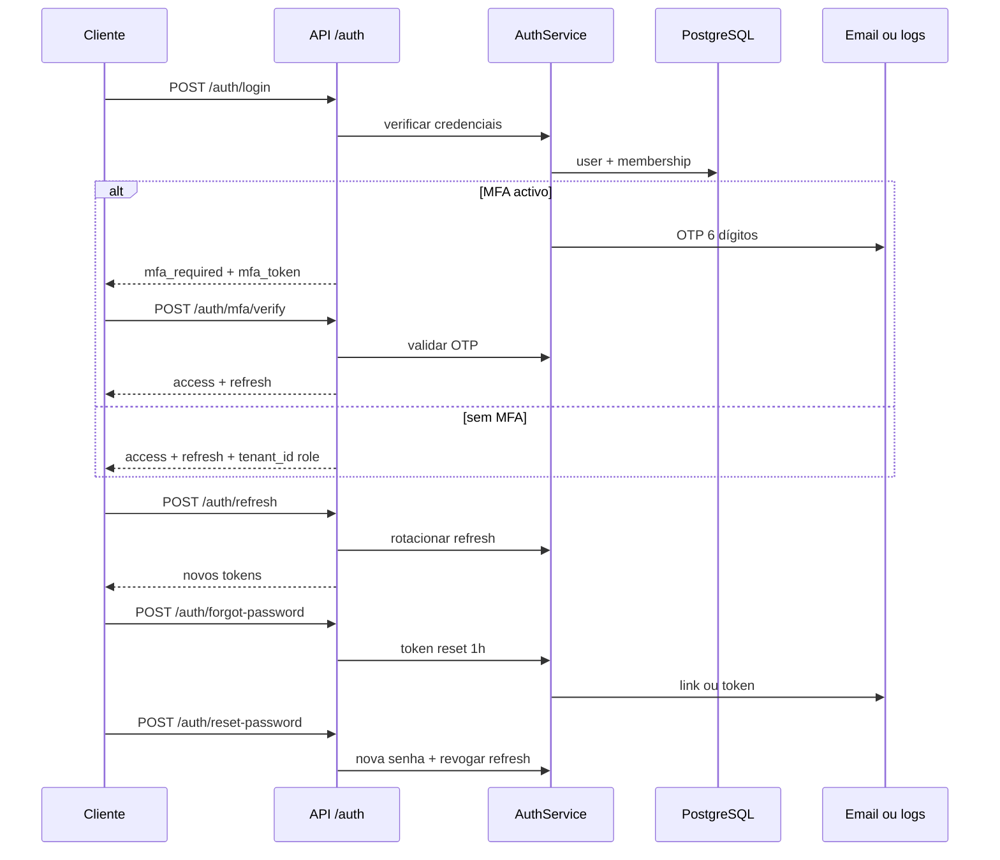
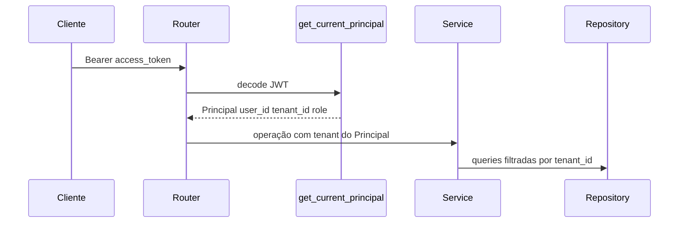

# Fluxo de autenticação (sequência)

## O que faz

Documenta login, MFA opcional, refresh e recuperação de senha.

Pedido autenticado subsequente:

## Como funciona

O `tenant_id` efectivo vem do JWT/membership validada — nunca só do body do cliente. Rate limits em login/refresh/forgot (slowapi).

## Como instalar / configurar

Variáveis `JWT_*`, `LOGIN_RATE_LIMIT`, `REFRESH_RATE_LIMIT`, `SMTP_*` — ver `.env.example` e [INSTALLATION.md](../INSTALLATION.md).

## Como testar

- `pytest` em `apps/api/tests` (auth + tenant).
- Exemplos: [`docs/examples/01-auth.sh`](../examples/01-auth.sh).

## Como evoluir

Novos factores MFA ou IdP federado → ADR + contratos `fourpro_contracts.auth` + regenerar OpenAPI.
