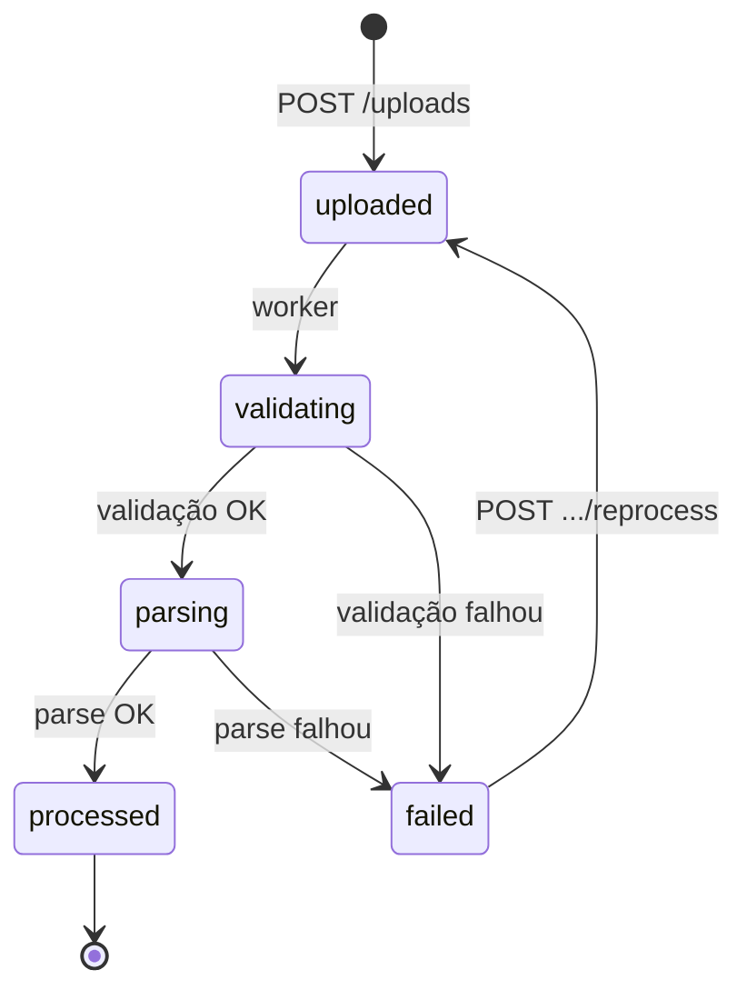
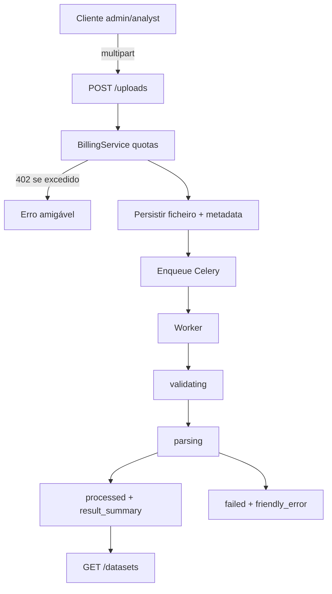

# Pipeline de ingestão — fluxograma e estados

## O que faz

Descreve o ciclo de vida de um ficheiro desde o upload até ao catálogo.

## Como funciona

Estados canónicos (`fourpro_contracts.ingestion`): `uploaded` → `validating` → `parsing` → `processed` | `failed`.  
Quotas (mensal + storage tenant/utilizador/grupo) só na aceitação do upload. Catálogo lista apenas `processed`.

Detalhe: [INGESTION.md](../INGESTION.md), [BILLING.md](../BILLING.md).

## Como instalar / configurar

`UPLOAD_DIR`, `MAX_UPLOAD_MB`, Redis para o worker — [INSTALLATION.md](../INSTALLATION.md).

## Como testar

- Unitários de upload/ingestão na API.
- Exemplo: [`docs/examples/02-upload-ingest.sh`](../examples/02-upload-ingest.sh).
- Smoke E2E de pipeline quando stack completa estiver no ar.

## Como evoluir

Conectores (TICKET-015) reutilizam o mesmo ciclo de status; novos estados exigem contrato + migração + este diagrama + OpenAPI.
