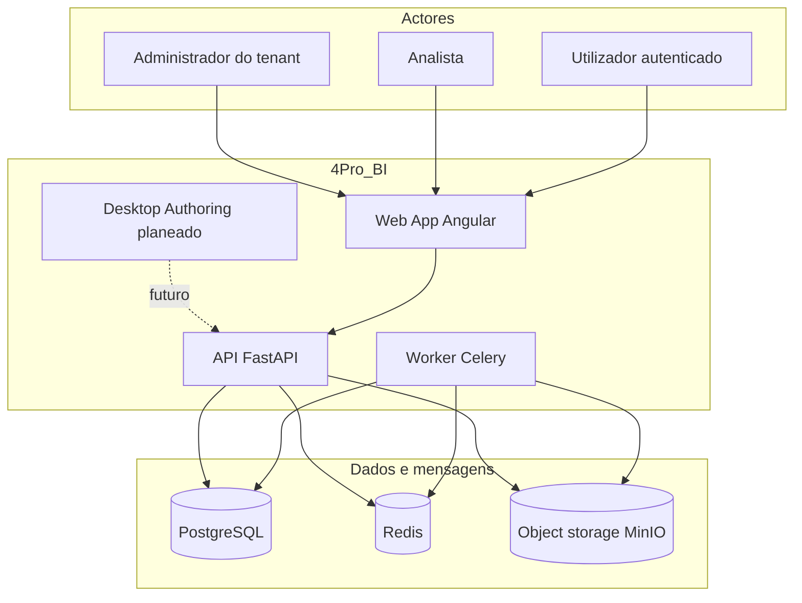

# Diagrama de contexto do sistema

## O que faz

Mostra actores externos e blocos principais da plataforma 4Pro_BI.

## Como funciona

Pedidos autenticados passam pela API; jobs pesados (parsing) vão para o Worker via Redis; ficheiros ficam em object storage / disco configurado; metadados e isolamento por `tenant_id` no PostgreSQL.

## Como instalar / configurar / testar / evoluir

Ver [INSTALLATION.md](../INSTALLATION.md), [DEPLOYMENT.md](../DEPLOYMENT.md) e [ARCHITECTURE.md](../ARCHITECTURE.md). Evolução Desktop/conectores: ADR-001 e tickets 015–017.
