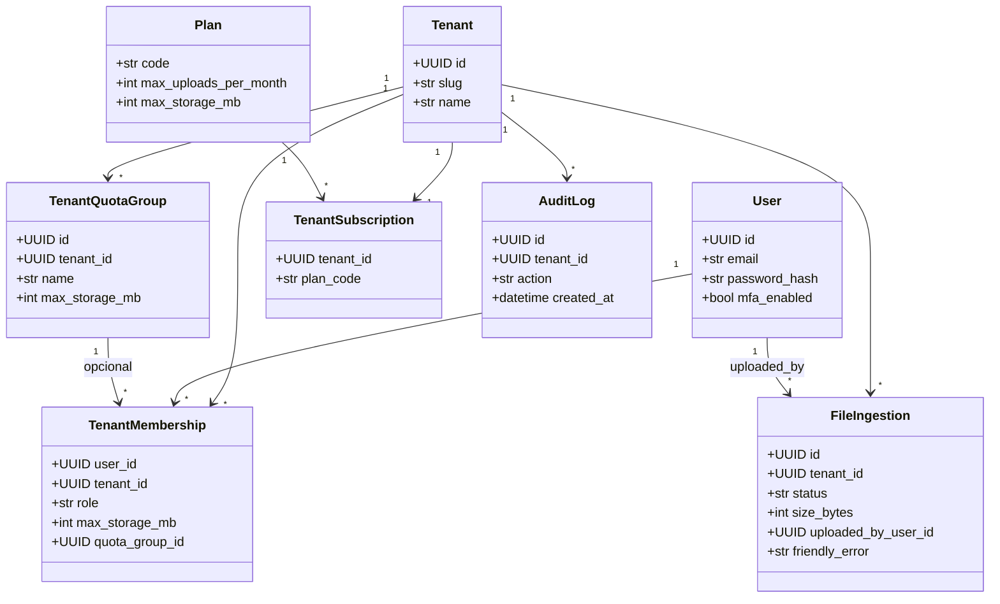

# UML — classes de domínio (Core / Data)

## O que faz

Vista simplificada das entidades persistidas relevantes ao multitenancy, auth e ingestão.

## Como funciona

Toda entidade de dados de cliente leva `tenant_id` (excepto tabelas só de plataforma). Papel inicial em `TenantMembership.role`; quotas em plano + membership + grupo.

## Como instalar / configurar

Schema via Alembic (`apps/api/alembic/`). Prefixo `core__` / `data__` nas revisões.

## Como testar

Testes de isolamento multi-tenant na API; seed `fourpro_api.dev_seed`.

## Como evoluir

Novas tabelas tenant-scoped → `tenant_id` + índices + testes de isolamento + nota em `ARCHITECTURE.md` / ADR se mudar o modelo.
