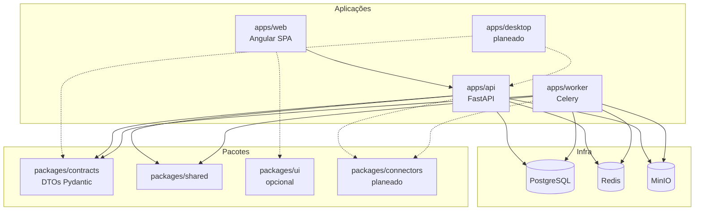

# UML — diagrama de componentes

## O que faz

Mostra componentes deployáveis e pacotes partilhados.

## Como funciona

A API agrega routers Core (auth, tenant, billing/me) e Data (uploads, ingestions, datasets). Contratos são a fronteira estável entre apps. Worker partilha modelos/repositórios necessários ao parsing sem expor HTTP.

## Como instalar / configurar / testar / evoluir

Build: Dockerfiles em `apps/*/`. Deploy: [DEPLOYMENT.md](../DEPLOYMENT.md).  
Evolução de boundaries → ADR + actualização deste diagrama e de `ARCHITECTURE.md`.
