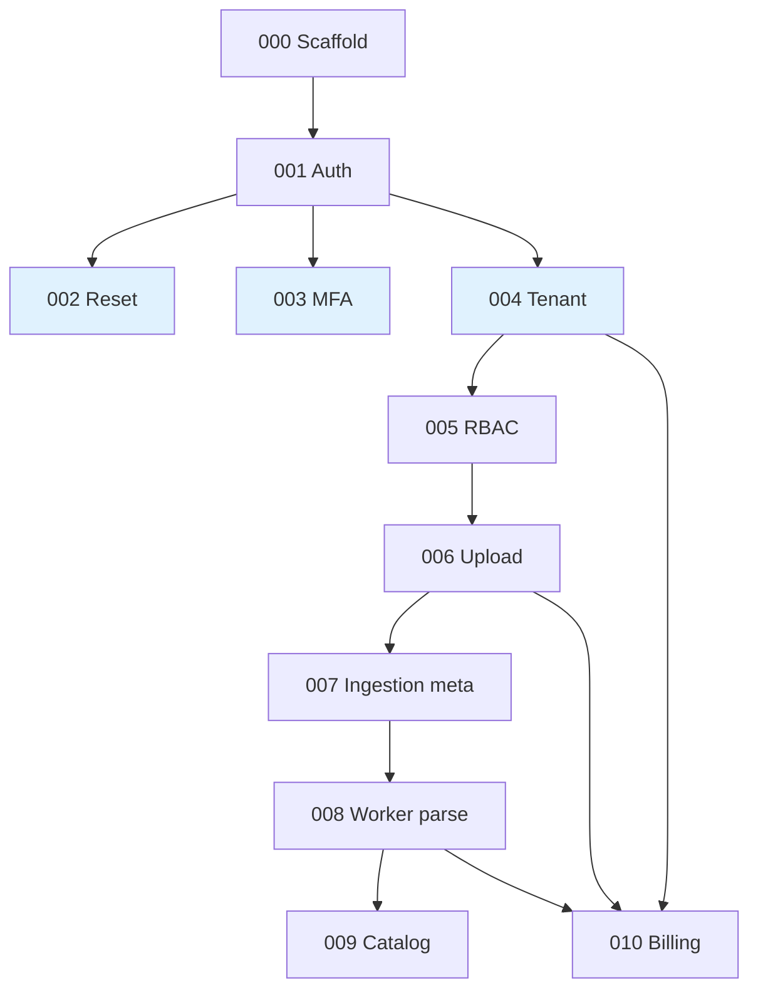

# Plano mestre de execução — 4Pro_BI

**Stack alvo:** FastAPI + SQLAlchemy + Alembic + PostgreSQL + Redis + Celery + Angular (`apps/web`), conforme `.cursor/rules`.

**Referência histórica:** `docs_planos_antigos/plans/` (stack OSS Keycloak/Superset) — usar como catálogo de decisões e marcos A–E, não como implementação obrigatória literal até ADR.

---

## 0. Execução paralela — princípio para toda a equipa

O **plano é único**; a **sequência na tabela abaixo é de dependências técnicas**, não de “uma pessoa de cada vez”. Expectativa: **várias pessoas em paralelo**, cada uma com tickets ou subtarefas do mesmo plano.

### 0.1 Regras de trabalho em paralelo

1. **Contrato primeiro** — DTOs / OpenAPI acordados em `packages/contracts` ou documento de rota antes de FE e BE divergirem longamente.
2. **PRs pequenos** — preferir merge frequente a ramos longos; migrações Alembic: **um dono por sprint** ou fila explícita no canal da equipa para evitar conflitos.
3. **Mock até integrar** — Frontend pode consumir mocks ou API stub enquanto backend fecha o ticket; inversamente, testes de API com `httpx`/`pytest` sem UI.
4. **Mesmo marco, vários trilhos** — Depois dos *gates* mínimos (ver §0.3), Backend, Frontend, Data e DevOps podem avançar **simultaneamente** em tickets diferentes da mesma fase.
5. **Definition of Done** — Continua a aplicar-se a **cada** PR (`docs/CHECKLISTS/`); paralelismo não dispensa testes nem isolamento de tenant.

### 0.2 Trilhos sugeridos (quem pode puxar o quê, em paralelo)

| Trilho | Foco típico | Tickets / trabalho paralelo (após gates) |
|--------|-------------|------------------------------------------|
| **API & domínio** | FastAPI, services, repos, migrations | 001→(002,003,004 em paralelo)→005→006→007→008→009→010 |
| **Web** | Angular, UX, guards | Login/MFA/reset em paralelo com 002–003; shell + páginas assim que 001/004 existirem; upload/ingestões/datasets alinhados a 006–009 |
| **Worker & fila** | Celery, parsing | Preparar worker/Redis cedo; **008** forte; apoio a 007 |
| **Infra & CI** | Compose, Portainer, pipelines | 000/014; endurecimento de envs; observabilidade base para **013** |
| **Produto / QA** | Wireframes, critérios, testes manuais | `docs/wireframes/validation-*.md`, smoke, sign-off em paralelo ao desenvolvimento |
| **Segurança / revisão** | Threat modeling leve, review de PRs | Transversal; foco em PRs de auth, tenant, upload |

Nenhum trilho é “exclusivo” de um papel: **todos executam o mesmo plano**, escolhendo tickets dentro das dependências e da capacidade da equipa.

### 0.3 Gates mínimos (o que desbloqueia paralelismo amplo)

| Gate | Condição | Depois disto, em paralelo |
|------|----------|---------------------------|
| **G0** | [000](../../tickets/TICKET-000-scaffold-monorepo.md) estável (compose + health) | Infra, primeiro spike API, primeiro spike web |
| **G1** | [001](../../tickets/TICKET-001-auth-core.md) com login + tokens | **002, 003 e 004** podem avançar **em paralelo** (coordenar migrations) |
| **G2** | [004](../../tickets/TICKET-004-tenant-foundation.md) + [005](../../tickets/TICKET-005-rbac.md) | **006** e UI autenticada multitenant; **010** (modelagem de planos) em paralelo com 006–007 |
| **G3** | [008](../../tickets/TICKET-008-parser-pipeline.md) | **009** + refinamentos de UI catálogo/dashboard em paralelo |
| **G4** | Dados da fase base fechados (até **009**) | **010** enforcement final; **011–014** conforme capacidade (ADR + CI + observabilidade) |

### 0.4 Diagrama de dependências (paralelismo após G1)

Após **001**, os nós em azul claro (**002, 003, 004**) são o **primeiro leque paralelo** principal. **010** liga-se a **004** (modelo) e endurece com **006–008** (enforcement).

---

## 1. Fases e ordem dos tickets

| Ordem | ID | Nome | Bloqueia |
|------|-----|------|----------|
| 0 | [TICKET-000](../../tickets/TICKET-000-scaffold-monorepo.md) | Scaffold monorepo + Compose + health | todos |
| 1 | [TICKET-001](../../tickets/TICKET-001-auth-core.md) | Auth core (login, JWT, refresh) | 002–005 |
| 2 | [TICKET-004](../../tickets/TICKET-004-tenant-foundation.md) | Tenant foundation | 005–010 (dados) |
| 3 | [TICKET-002](../../tickets/TICKET-002-password-recovery.md) | Password recovery | produto completo login |
| 4 | [TICKET-003](../../tickets/TICKET-003-mfa-email.md) | MFA email | endurecer admin |
| 5 | [TICKET-005](../../tickets/TICKET-005-rbac.md) | RBAC / grupos | upload, admin |
| 6 | [TICKET-006](../../tickets/TICKET-006-file-upload.md) | File upload | 007 |
| 7 | [TICKET-007](../../tickets/TICKET-007-ingestion-metadata.md) | Ingestion metadata | 008 |
| 8 | [TICKET-008](../../tickets/TICKET-008-parser-pipeline.md) | Parser pipeline + worker | 009 |
| 9 | [TICKET-009](../../tickets/TICKET-009-dataset-catalog.md) | Dataset catalog | workspace/BI |
| 10 | [TICKET-010](../../tickets/TICKET-010-billing-core.md) | Billing core | enforcement |

**Paralelos seguros (resumo):**

- **002, 003 e 004** em paralelo após **001** (coordenar migrações e fila de email).
- **Frontend** em paralelo com **002–009** sempre que o contrato HTTP estiver definido ou mockado.
- Modelagem de **010** (tabelas `plans`) após **004**; **enforcement** de quotas amarra com **006–008**.
- **014 (CI)** pode avançar em paralelo assim que existir repositório remoto e testes mínimos (**001**), sem bloquear features.

### 1.1 Fase seguinte (tickets 011–014)

| Ordem | ID | Nome | Marco / nota |
|------|-----|------|----------------|
| — | [TICKET-011](../../tickets/TICKET-011-workspace-dashboards.md) | Workspace e dashboards | **C** — BI utilizável |
| — | [TICKET-012](../../tickets/TICKET-012-data-governance.md) | Governança de dados / camadas | **B** — dados governados |
| — | [TICKET-013](../../tickets/TICKET-013-observability-enterprise.md) | Observabilidade e enterprise | **E** — audit + ops |
| — | [TICKET-014](../../tickets/TICKET-014-ci-quality-gates.md) | CI e quality gates | §4 plano mestre |

Resumos: [`PLANOS-POR-TICKET-011-014.md`](./PLANOS-POR-TICKET-011-014.md). Planos detalhados: `docs/plans/TICKET-011-*` … `TICKET-014-*`.

**Paralelismo (011+):** **011** e **012** podem evoluir em paralelo após ADRs alinhados; **013** (observabilidade) e **014** (CI) são transversais e podem avançar com qualquer trilho que toque API/worker/web.

---

## 2. Marcos (alinhados aos planos antigos, adaptados)

| Marco | Após | Demonstrável |
|-------|------|--------------|
| **A — Laboratório** | 008 + UI upload/histórico | Arquivo sobe, job processa, status visível |
| **B — Dados governados** | Evolução pós-fase-base (transformações SQL versionadas / camadas se ADR) | Bronze/silver/gold ou equivalente na API |
| **C — BI utilizável** | Roadmap Fase 3 + ADR (analytics incorporado ou canvas próprio) | Dashboard multitenant, UX unificada |
| **D — SaaS fechável** | 010 enforcement | Quotas bloqueiam uso |
| **E — Enterprise** | MFA forte, auditoria, observabilidade | Checklist security |

---

## 3. Definition of Done (cada entrega)

1. Testes mínimos (pytest no API; unit no front quando UI).
2. Logs estruturados em fluxos críticos (`correlation_id` quando existir).
3. Sem segredos no Git; apenas `.env.example`.
4. Isolamento por tenant em toda rota que toca dados de cliente (a partir do TICKET-004).
5. Atualizar `docs/ARCHITECTURE.md` ou ADR quando mudar decisão estrutural.

---

## 4. Branches e CI (evolução)

- **Curto prazo:** `main` + PRs pequenos; `infra/compose` para dev local.
- **P0-07 equivalente:** adicionar workflow GitHub/GitLab (lint + `pytest apps/api`) quando o repositório for versionado remotamente.

---

## 5. Deploy Portainer (stacks)

- Stack completa: `infra/portainer/stack-4pro-bi.yml` — ver `infra/portainer/README.md`.
- Desenvolvimento local sem Portainer: `infra/compose/docker-compose.yml` + `scripts/run-ticket-pipeline.sh`.

## 6. Próximo passo imediato

1. Dev local (host partilhado): `./scripts/dev-local.sh` — sobe Postgres/Redis/MinIO e lista comandos para `uvicorn --reload` + `ng serve` (portas em `.env`, ex. API **7418**, front **4200**).
2. Subir stack completa: `docker compose -f infra/compose/docker-compose.yml up -d` **ou** implantar stack no Portainer (`infra/portainer/`). Atalhos: `./scripts/stack-up.sh`, `make stack-up`; parar: `./scripts/stack-down.sh` (volumes: `STACK_DOWN_VOLUMES=1`); estado/logs: `./scripts/stack-ps.sh`, `./scripts/stack-logs.sh`.
3. Migrações: ver `apps/api/README.md`.
4. QA antes de PR: `./scripts/run-qa-gates.sh`.
5. Opcional: `./scripts/run-qa-optional.sh` (Alembic em Postgres Docker efémero + suite Playwright; `E2E_INSTALL_BROWSERS=1` na 1.ª vez; `cp e2e/.env.e2e.example e2e/.env.e2e`).
6. Endurecer produção: MFA/reset por email real (SMTP), e2e contra stack Portainer, MinIO no upload (opcional). Após bootstrap: `RUN_SEED=false` no `.env` da stack; `RATE_LIMIT_TRUST_PROXY` só com proxy de confiança (ver `infra/portainer/README.md`).
