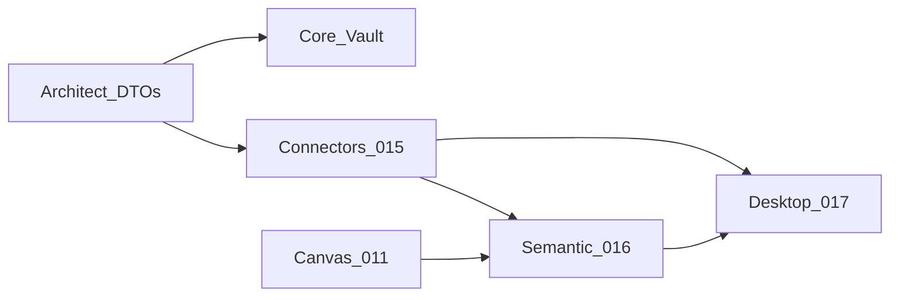

# Paralelismo Fase 4 BI — frentes e agentes

**Programa:** [`PLATAFORMA-BI-CONNECTORS-DESKTOP-WEB.md`](./PLATAFORMA-BI-CONNECTORS-DESKTOP-WEB.md) · ADR-001  
**Agentes Cursor:** [`.cursor/agents/README.md`](../../.cursor/agents/README.md)  
**Prompts coláveis:** [`PROMPTS-CHATS-BI.md`](./PROMPTS-CHATS-BI.md)

Complementa [PARALELA-5-FRENTES.md](./PARALELA-5-FRENTES.md) (fase base 000–010). Aqui o foco é **015–017** (+011).

---

## 1. Sessões paralelas recomendadas

| Chat | Nome Cursor | Agente | Ticket / foco |
|------|-------------|--------|----------------|
| **B0** | `4Pro BI — Coordenação` | `/coordenador` | Gate G5, ordem de PRs, Alembic |
| **B1** | `4Pro BI — Connectors` | `/connectors` | **015** SPI + postgres/REST + sync |
| **B2** | `4Pro BI — Semantic Web` | `/semantic-bi` | **016** + widgets **011** |
| **B3** | `4Pro BI — Desktop` | `/desktop` | **017** (após APIs mínimas) |
| **B4** | `4Pro BI — QA` | `/qa-reviewer` | testes sync/query/publish |
| **B5** | `4Pro BI — Security` (opc.) | `/security-reviewer` | vault, SSRF, tokens Desktop |

Apoio transversal (abrir sob demanda):

| Chat | Agente | Quando |
|------|--------|--------|
| F1 | `/architect` | DTOs `connectors` / `semantic` / `desktop_sync` |
| F2 | `/backend-core` | vault, wiring `main.py`, seats billing |
| F4 | `/frontend` | se B2 só fizer API e a UI for noutro chat |

---

## 2. Ondas de paralelismo

### Onda BI-0 — Contratos (curta, serializa pouco)

| Frente | Entrega |
|--------|---------|
| Architect | DTOs `connectors` + nota de impacto |
| Coordenação | Confirmar gate G4/G5 e fila Alembic |

### Onda BI-1 — Após contratos connectors (paralelo)

| Frente | Entrega |
|--------|---------|
| **Connectors (B1)** | SPI, `file` adapter, `postgres`, `rest_json`, APIs data-sources |
| **Core (F2)** | Vault + audit events + limite `max_data_sources` (se aplicável) |
| **QA (B4)** | Esqueleto testes isolamento + “secret never in GET” |
| **Frontend / Semantic** | Mock UI Fontes **ou** esperar OpenAPI |

### Onda BI-2 — Após primeiro sync O1 verde

| Frente | Entrega |
|--------|---------|
| **Semantic (B2)** | Modelo semântico + `/query` + widgets 011 |
| **Frontend** | Lista Fontes + binding dashboard (se separado de B2) |
| **Connectors** | Hardening + 2.º conector O1 |
| **QA** | Testes query cross-tenant negado |

### Onda BI-3 — Desktop (após publish APIs)

| Frente | Entrega |
|--------|---------|
| **Desktop (B3)** | Scaffold + auth + wizard + publish |
| **Architect** | ADR-002 runtime se spike concluir |
| **QA / Security** | Smoke publish + secure storage |

---

## 3. Allowlists extra (Fase 4)

| Dono | Pode editar (além das regras F1–F5) |
|------|-------------------------------------|
| **connectors** | `packages/connectors/**`; routers/services data-sources **novos**; worker sync; migrações `data__*connectors*` / data_sources |
| **semantic-bi** | routers/services semantic/query/dashboards **novos**; `apps/web` Fontes/workspace se a sessão for full-stack BI |
| **desktop** | `apps/desktop/**` |
| **backend-core** | vault credentials; `include_router` para rotas novas; billing seats |
| **architect** | `fourpro_contracts.connectors`, `.semantic`, `.desktop_sync` |

**Inegociável:** Connectors **não** edita `main.py`. Desktop **não** altera API de produção excepto via pedidos documentados às outras frentes.

---

## 4. Branches sugeridas

- `feat/bi-f1-contracts-connectors`
- `feat/bi-015-connector-spi`
- `feat/bi-015-connector-postgres`
- `feat/bi-016-semantic-query`
- `feat/bi-011-dashboard-canvas`
- `feat/bi-017-desktop-scaffold`
- `chore/bi-f2-wire-data-sources-router`
- `test/bi-qa-connectors`

---

## 5. Ritual diário (10 min)

1. Sync O1 já produz dataset `processed`?  
2. Algum PR bloqueado à espera de contrato F1?  
3. Quem tem a próxima migração `data__`?  
4. Desktop ainda em espera (correcto até G5 parcial)?  

---

## 6. Como lançar hoje

1. Abrir **B0** com `/coordenador` + prompt B0 em `PROMPTS-CHATS-BI.md`.  
2. Abrir **B1** `/connectors` e **F2** `/backend-core` (vault) em paralelo após DTOs.  
3. Manter **B3** `/desktop` em pausa até existir `POST .../sync` estável.  
4. **B4** `/qa-reviewer` corre em cada PR da onda.
