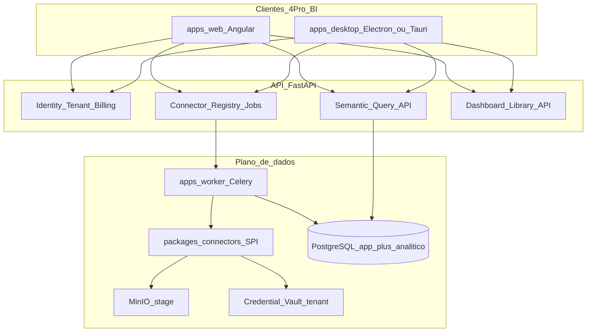

# Plano mestre — Plataforma BI 4Pro_BI (conectores + Web + Desktop)

**ADR:** [`docs/adr/001-bi-platform-connectors-desktop-web.md`](../adr/001-bi-platform-connectors-desktop-web.md)  
**Tickets:** 015 · 016 · 017 (e evolução de 011 / 012)  
**Papéis:** Architect · Backend Data · Backend Core · Frontend · Security · QA

## 1. Objetivo

Evoluir o 4Pro_BI de “SaaS de upload e catálogo” para uma **plataforma de analytics** com:

1. **Ingestão extensível** — framework de plugins de conectores (ficheiro, SQL, APIs, object storage), no espírito de “Get Data”, com pipeline, quotas e isolamento por tenant.
2. **Experiência dual** — **Web** (consumo, governação, admin SaaS) e **Desktop** (autoração e modelagem pesada), no espírito MicroStrategy Desktop + Web, com marca e UX 100% 4Pro_BI.

## 2. Estado actual (baseline)

| Capacidade | Hoje |
|------------|------|
| Upload ficheiro (txt/csv/xls/xlsx/json) | Implementado |
| Pipeline Celery + status | Implementado |
| Catálogo `GET /datasets` | Implementado (linhas processadas) |
| Framework de conectores | **Inexistente** |
| Modelo semântico / query agregada | **Inexistente** |
| Canvas de dashboards editável | Planeado (TICKET-011) |
| App Desktop | **Inexistente** |

## 3. Arquitectura alvo

### Separação de responsabilidades

| Camada | Dono | Responsabilidade |
|--------|------|------------------|
| Registry + jobs de sync | Backend Data (F3) | Listar conectores, enfileirar extract, status |
| Cofre + audit + billing seats | Backend Core (F2) | Segredos, MFA, quotas, auditoria de sync |
| SPI + plugins | `packages/connectors` | Implementações versionadas |
| Semântica + query | Backend Data + Architect | Modelos, RLS, agregações |
| Web workspace | Frontend | Biblioteca, viewer, admin de fontes |
| Desktop | Frontend + Architect | Autoração, publish, cache local de rascunhos |

## 4. Framework de conectores (contrato SPI)

Interface mínima (conceitual; DTOs em `fourpro_contracts.connectors` no TICKET-015):

| Método | Entrada | Saída |
|--------|---------|-------|
| `capabilities` | — | auth kinds, incremental?, max sample |
| `validate_config` | config JSON | erros de validação |
| `test_connection` | config + secret refs | ok / mensagem amigável |
| `discover` | config | lista de objectos (tabelas, paths, endpoints) |
| `sample_schema` | object ref | colunas + tipos inferidos |
| `extract` | object ref + cursor opcional | stream/chunks → stage MinIO + metadata |

### Famílias — ondas

| Onda | Conectores | Valor |
|------|------------|-------|
| **O0** | `file` (actual upload) | Paridade com hoje |
| **O1** | `postgres`, `mysql` / `sqlserver`, `rest_json` | SQL + API — 80% dos casos enterprise |
| **O2** | `s3_compatible`, `google_sheets`, `bigquery` | Cloud / folhas |
| **O3** | ODBC genérico, SAP/ERP via API, connectors verticais | Long tail |

Plugins vivem no monorepo (ou wheel assinado); **não** há marketplace público no MVP.

## 5. Fluxo de ingestão unificado

1. Utilizador (Web ou Desktop) escolhe fonte → configura → `test_connection`.
2. API persiste `data_source` (`tenant_id`, `connector_type`, config sem segredos, refs de vault).
3. Job `sync` / `extract` → worker → plugin → stage → validação → parsing/normalização → catálogo.
4. Status e logs técnicos + mensagem amigável (regra de ingestão existente).
5. Reprocessamento e versionamento básicos (TICKET-012 alinha camadas bronze/silver quando aplicável).

## 6. Web vs Desktop

| Função | Web | Desktop |
|--------|-----|---------|
| Login / MFA / troca de tenant | Sim | Sim |
| Admin tenant, billing, auditoria | Sim | Não (ou read-only) |
| Configurar fontes e sync | Sim (MVP) | Sim (avançado) |
| Modelagem semântica | Leve | Completa |
| Autoração de dashboard / dossier | Leve (TICKET-011) | Completa (TICKET-017) |
| Consumo / partilha / export | Sim | Preview + publish |
| Offline rascunho | Não | Sim (limitado) |

## 7. Fases de entrega (técnicas)

### Fase P — Planeamento (este documento + ADR-001)

- [x] ADR-001
- [x] Tickets 015–017
- [ ] Revisão Product: prioridade de conectores O1

### Fase A — TICKET-015 Connector framework

- Pacote SPI + registry
- Modelos `data_sources`, `connector_credentials`, jobs
- Conector `file` adaptado ao SPI
- Conectores O1: PostgreSQL + REST JSON
- Testes isolamento tenant + secret never leaked

### Fase B — TICKET-016 Semantic + Web BI

- Modelo semântico mínimo + API query
- Integração com TICKET-011 (widgets consomem query API)
- UI Web: Fontes de dados + biblioteca de dashboards

### Fase C — TICKET-017 Desktop

- Scaffold app Desktop + auth
- Fluxo: conectar SQL → sample → publish dataset
- Autoração dashboard + publish para Web
- Empacotamento (CI artefactos)

### Fase D — Escala

- Onda O2/O3 de conectores
- Schedules / subscriptions
- Quotas por conector e seats Desktop no billing

## 8. Impacto transversal

| Área | Impacto |
|------|---------|
| **Backend** | Novos routers/services/repos; worker plugins; migrações `data__*` e vault `core__*` |
| **Frontend** | Rotas Fontes de dados; evolução workspace; app Desktop nova |
| **Dados** | Stage por sync; versionamento; possível warehouse analítico (ADR TICKET-012) |
| **Segurança** | Vault, allowlist egress, audit sync/publish, MFA no Desktop |
| **Billing** | Limites: nº fontes, volume sync/mês, seats Desktop |
| **Contratos** | Novos módulos `connectors`, `semantic`, `desktop_sync` — impacto documentado (F1) |

## 9. Fora de escopo (programa inicial)

- Clonar feature-parity total com Power BI / MicroStrategy
- Marketplace público de plugins
- Mobile nativo
- OLAP cube completo / MDX
- Streaming real-time (CDC) — fase futura
- Whitelabel completo (continua Marco E / TICKET-013)

## 10. Riscos

| Risco | Mitigação |
|-------|-----------|
| Scope infinito de conectores | Ondas O0–O3; SPI estável; só O1 no primeiro release |
| Fuga de segredos | Vault + testes; secrets nunca em logs/DTOs de listagem |
| Multitenant no motor embed | BFF + guest token curto; ADR-001 + TICKET-011 |
| Desktop divergir do Web | Contratos partilhados; design system; publish como fonte de verdade |
| Custo de egress/sync | Quotas billing + rate limit por tenant |

## 11. Critérios de aceite do programa

Ver ADR-001 § Critérios de sucesso. Cada ticket 015–017 tem critérios próprios nos cartões e planos detalhados.

## 12. Próximos passos imediatos

1. Product confirma lista O1 (Postgres + REST; opcional MySQL/SQL Server).
2. Architect fecha schema JSON dos conectores O1 em contratos.
3. Implementar TICKET-015 em PRs pequenos (SPI → file adapter → Postgres → REST).
4. Em paralelo: ADR de canvas TICKET-011 alinhado à query API de 016.
