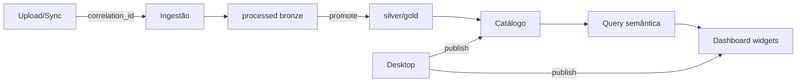

# Produto — Onda BI (Marcos B, C, E + plataforma conectores)

## Discovery (obrigatório)

- **Problema:** O tenant já sobe e processa ficheiros, mas ainda não governa camadas, não monta dashboards BI, não liga fontes externas nem rastreia um pedido de ponta a ponta — o valor do dado para decisão fica incompleto.
- **Quem utiliza:** admin tenant (governação, fontes, auditoria), analyst (dashboards, sync, promoção), consumer (leitura de dashboards/catálogo), ops (métricas/correlation).
- **Valor:** tempo até insight (dataset processado → dashboard), redução de risco (isolamento + auditoria + lineage), expansão de fontes sem sair do 4Pro_BI.
- **Como será medida:** % ingestões com `correlation_id` rastreável; % datasets com `layer` definida; nº dashboards activos/tenant; nº fontes sync `processed`; time-to-first-dashboard após primeiro upload.

## Personas

| Persona | Papel | Objetivos | Dores | Frequência |
|---------|-------|-----------|-------|------------|
| Ana Admin | admin | Controlar equipa, quotas, auditoria, fontes | Falta de rastreio e retenção | Diária |
| Luís Analyst | analyst | Promover dados, criar dashboards, sync | Catálogo sem camada; sem widgets | Diária |
| Carla Consumer | consumer | Consultar dashboards e catálogo | UI confusa / dados cruzados | Semanal |
| Ops | platform | Observabilidade e quotas | Logs sem ID único | Contínua |

## Casos de uso

### UC-01 — Rastrear upload → processed por correlation_id
- Actor: Ops / admin
- Pré-condições: API+worker activos
- Fluxo: upload gera `X-Request-ID`; worker propaga; logs e audit partilham o mesmo ID
- Alternativas: cliente envia ID válido (UUID); senão API gera
- Pós-condições: pesquisa por um ID cobre o fluxo

### UC-02 — Promover dataset bronze → silver/gold
- Actor: analyst/admin
- Fluxo: POST promote com camada alvo; lineage `source_ingestion_id`; falha fica `failed` com log
- Pós-condições: catálogo filtra por `layer`

### UC-03 — Criar dashboard com widgets
- Actor: analyst/admin; consumer só lê
- Fluxo: CRUD dashboard; widgets KPI/tabela ligados a dataset do catálogo
- Alternativas: dataset ausente → placeholder D5
- Pós-condições: tenant A não vê dashboards de B

### UC-04 — Registar fonte e sync
- Actor: analyst/admin
- Fluxo: CRUD data source; test; sync → ingestão no mesmo tenant
- Alternativas: secret nunca em listagem; erro de ligação auditado

## User Stories

- US-01: Como ops, quero um ID de correlação ponta a ponta, para diagnosticar falhas sem adivinhar logs.
- US-02: Como analyst, quero promover dados por camada, para distinguir cru de curado.
- US-03: Como analyst, quero dashboards com widgets, para partilhar KPIs com o tenant.
- US-04: Como admin, quero fontes Postgres/REST com credenciais encriptadas, para deixar de depender só de ficheiro.
- US-05: Como analyst, quero um modelo semântico mínimo e query agregada, para alimentar widgets sem SQL ad-hoc.
- US-06: Como autor Desktop, quero publicar dataset/dashboard na API do tenant, para a Web consumir.

## Fluxos

## KPIs

| KPI | Definição | Baseline | Alvo | Janela |
|-----|-----------|----------|------|--------|
| Trace coverage | % jobs com correlation_id | 0 | ≥95% | 7 dias |
| Layered datasets | % processed com layer ≠ null | 0 | 100% (default bronze) | contínuo |
| Dashboards/tenant | média dashboards activos | 0 | ≥1 nos tenants demo | 30 dias |
| Sync success | % sync → processed | n/a | ≥80% em fixtures | CI |

## Métricas

| Métrica / evento | Onde observar | Ligação ao KPI |
|------------------|---------------|----------------|
| `http_requests_total` | `/metrics` | saúde API |
| `audit_log` + correlation | auditoria admin | UC-01 |
| `data_source.sync.*` | audit + sync_runs | US-04 |
| `dashboard.*` | audit | US-03 |

## Critérios de aceite

- [x] Isolamento por tenant em dashboards, camadas, fontes, semântica
- [x] Permissão por perfil (consumer read-only em edição)
- [x] Secrets ausentes das respostas de fontes
- [x] Correlation ID API → worker
- [x] Testes mínimos por domínio novo

## Roadmap

- Fase / onda: Pós fase base (000–010) — Marcos B/C/E + G5 conectores
- Tickets: 011, 012, 013, 015, 016, 017
- Dependências: 009 catálogo; 010 quotas; ADR-001 aceite

## Backlog derivado

| Item | MoSCoW | Notas |
|------|--------|-------|
| Correlation + metrics | Must | 013 |
| Layers + promote | Must | 012 |
| Dashboards canvas MVP | Must | 011 |
| Connector SPI O1 | Must | 015 |
| Semantic + query | Should | 016 MVP |
| Desktop scaffold + publish | Should | 017 scaffold |
| Embed motor OSS | Won’t | fora desta onda |
| Marketplace conectores | Won’t | pós O2 |

## Priorização

Método: MoSCoW + risco/dependência  
Ordem: **013 → 012 → 011 → 015 → 016 → 017** (018 fica ADR proposto, sem código Next).

## Handoff

- Próximo: implementação Backend Data/Core + Frontend Angular + worker
- Fora de escopo: whitelabel, OLAP, SOC2 formal, React/Next em `apps/web`
