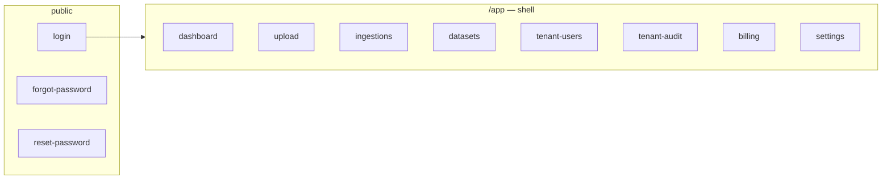

# Validação de wireframes (ferramentas da plataforma)

Documentos nesta pasta descrevem **o que** cada área da UI deve validar com stakeholders e QA antes do desenho visual final (Figma) e da implementação Angular.

**Referências no repositório:**

- PDF na raiz: `Data Analytics Solution.pdf` (protótipo visual; link embutido para `https://dig-wired-11893301.figma.site/`).
- Planos históricos OSS (P0–P8): pasta [`docs_planos_antigos/plans/`](../../docs_planos_antigos/plans/README.md).
- Ponte PDF + Figma + planos antigos + tickets: [REFERENCIAS-MATERIAIS-LEGADOS.md](./REFERENCIAS-MATERIAIS-LEGADOS.md).

O conteúdo das folhas `validation-*.md` permanece alinhado a `docs/VISION.md`, `docs/ROADMAP.md` e `tickets/`; os materiais acima refinam **wireframes e marcos comerciais** (A–E).

## Índice

| Documento | Domínio |
|-----------|---------|
| [validation-admin-identity.md](./validation-admin-identity.md) | Login, MFA, reset, admin (fluxos + mapa para rotas Angular + exports) |
| [validation-data-pipeline.md](./validation-data-pipeline.md) | Upload, ingestão, catálogo (+ dashboard resumo + exports) |
| [validation-workspace-dashboards.md](./validation-workspace-dashboards.md) | Workspace alvo Fase 3 vs implementação atual (`/app/dashboard`) + exports |

## Mapa de navegação (app atual)

Fluxo simplificado da SPA; detalhe em `apps/web/src/app/app.routes.ts`.



## Wireframe lógico do shell (ASCII)

```
┌─────────────────────────────────────────────────────────────┐
│ SIDEBAR          │  TOPBAR (título área)                      │
│ · Dashboard      ├───────────────────────────────────────────┤
│ · Upload*        │                                            │
│ · Ingestões      │  CONTEÚDO (router-outlet)                  │
│ · Catálogo       │                                            │
│ · Equipa†        │                                            │
│ · Auditoria†     │                                            │
│ · Cobrança       │                                            │
│ · Configurações  │                                            │
│ Tenant + papel   │                                            │
│ [Sair]           │                                            │
└─────────────────────────────────────────────────────────────┘
  * Upload: admin/analyst  † Equipa/Auditoria: admin
```

## Imagens e evidências visuais

Capturas ou exports que comprovem o sign-off devem seguir a convenção em **[`docs/assets/README.md`](../assets/README.md)** (pasta `docs/assets/wireframes/exports/`). Nos próprios `validation-*.md`, use links para esses ficheiros quando existirem.

- **PDF → PNG:** `make wireframes-export` ou [`scripts/export-wireframes-from-pdf.sh`](../../scripts/export-wireframes-from-pdf.sh) → `data-analytics-solution-p-*.png`.
- **Capturas da app (Playwright, opcional):** `e2e/tests/wireframe-validation-captures.spec.ts` com `E2E_WIREFRAME_CAPTURES=1` — ver [`e2e/README.md`](../../e2e/README.md).

## Como usar

1. Product/UX marca cada critério como **validado**, **ajustar** ou **fora de escopo** com data e responsável.  
2. Architect confirma se o backend suporta os estados e endpoints necessários.  
3. Security Reviewer marca riscos em telas que exponham dados sensíveis ou ações críticas.  
4. Quando houver evidência gráfica, anexar ficheiro nomeado em `docs/assets/wireframes/exports/` e referenciar na folha de validação.
