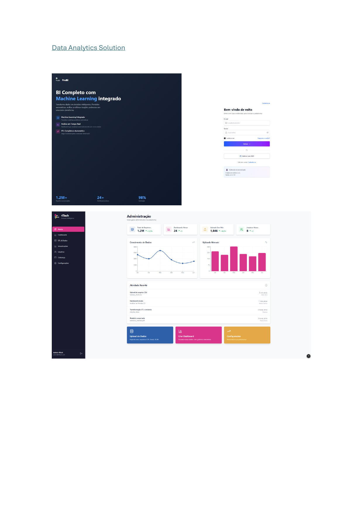

# Validação de wireframe — Admin e Identidade

**Versão:** 0.8  
**Escopo de produto:** login, MFA (ticket), recuperação de senha, administração de usuários e grupos, indicação clara do tenant atual.

## 0. Evidências visuais (exports)

Colocar capturas ou exports em [`docs/assets/wireframes/exports/`](../assets/wireframes/exports/) e referenciar aqui.

**PDF de referência (repo):** `Data Analytics Solution.pdf` (raiz do projeto). Para gerar páginas em PNG (exemplo):

`pdftoppm -png "Data Analytics Solution.pdf" docs/assets/wireframes/exports/data-analytics-solution-p`  
ou, a partir da raiz do repo: `bash scripts/export-wireframes-from-pdf.sh`

→ ficheiros `data-analytics-solution-p-1.png` … conforme número de páginas.

**Capturas da app (opcional):** `cd e2e && E2E_WIREFRAME_CAPTURES=1 npm run test:wireframe-captures` (carregar `e2e/.env.e2e`; utilizador **admin** sem MFA) — gera `identity-login-v1-YYYYMMDD.png`, `identity-forgot-v1-*.png`, `identity-reset-v1-*.png`, `workspace-shell-v1-*.png`, `workspace-dashboard-v1-*.png`, `pipeline-*`, `identity-admin-users-v1-*.png`, `tenant-audit-v1-*.png`, `billing-overview-v1-*.png`, `settings-placeholder-v1-*.png` na mesma pasta. Ver `e2e/README.md`.

**Exports atuais no repo (7 páginas):** `data-analytics-solution-p-1.png` … `data-analytics-solution-p-7.png` em [`../assets/wireframes/exports/`](../assets/wireframes/exports/).  
Pré-visualização (pág. 1):  

| Sugestão de ficheiro | Conteúdo |
|----------------------|----------|
| `data-analytics-solution-p-*.png` | Export direto do PDF de wireframe (fonte única de layout) |
| `identity-login-v1-YYYYMMDD.png` | Ecrã `/login` (passo email/senha) |
| `identity-mfa-v1-YYYYMMDD.png` | Mesmo ecrã, passo código MFA |
| `identity-forgot-v1-YYYYMMDD.png` | `/forgot-password` |
| `identity-reset-v1-YYYYMMDD.png` | `/reset-password` |
| `identity-admin-users-v1-YYYYMMDD.png` | `/app/tenant-users` (membros) |
| `tenant-audit-v1-YYYYMMDD.png` | `/app/tenant-audit` |
| `billing-overview-v1-YYYYMMDD.png` | `/app/billing` |
| `settings-placeholder-v1-YYYYMMDD.png` | `/app/settings` |

*Exemplo de referência no markdown (quando o ficheiro existir):*  
``

## 0.1 Mapeamento — implementação atual (`apps/web`)

| Bloco | Rotas / componente | Cobertura atual (fase base) |
|-------|-------------------|-------------------------------|
| Login L1–L5 | `/login` → `LoginComponent` | Sim |
| MFA M1–M3 | `/login` (passo interno `mfa`) | Parcial: reenvio/throttle M2 a validar na UI |
| Reset R1–R3 | `/forgot-password`, `/reset-password` | Sim |
| Admin A1–A4 | `/app/tenant-users` → `TenantUsersComponent` (só `admin`) + `GET /api/v1/tenant/members` | Listagem de membros e papel; convites/cadastro avançado em evolução |

## 1. Objetivo da validação

Garantir que as telas de identidade e administração cubram estados obrigatórios (loading, erro, vazio, sucesso), não expõem diferenças semânticas que permitam enumeração de contas, e deixam explícito **qual tenant** está ativo em contexto administrativo.

## 2. Telas / blocos

### 2.1 Login (TICKET-001)

| # | Elemento / comportamento | Critério de aceite |
|---|---------------------------|--------------------|
| L1 | Campos email, senha | Validação client-side mínima; servidor é fonte da verdade |
| L2 | Erro de credenciais | Mensagem genérica (“Credenciais inválidas”) |
| L3 | Loading | Desabilitar submit durante requisição |
| L4 | Sucesso | Redirecionar para shell da aplicação ou passo MFA (TICKET-003) |
| L5 | Rate limit | Mensagem amigável + opcional tempo de espera |

### 2.2 MFA por email (TICKET-003) — wireframe lógico

| # | Comportamento | Critério |
|---|---------------|----------|
| M1 | Após login, se MFA exigido | Tela de código; sem dados sensíveis na URL |
| M2 | Reenvio de código | Throttle visível; confirmação sem revelar email completo |
| M3 | Código expirado | Mensagem clara; fluxo para solicitar novo |

### 2.3 Recuperação de senha (TICKET-002)

| # | Comportamento | Critério |
|---|---------------|----------|
| R1 | Solicitar reset | Confirmação única (“Se existir conta, enviaremos email”) |
| R2 | Link com token | Tela nova senha; token inválido/expirado tratado |
| R3 | Pós-sucesso | Login; sem auto-login por padrão (decisão de produto a validar) |

### 2.4 Admin — usuários e grupos (TICKET-005 + tenant)

| # | Comportamento | Critério |
|---|---------------|----------|
| A1 | Cabeçalho | Nome/slug do **tenant atual** sempre visível |
| A2 | Lista usuários | Vazia: CTA para convite/cadastro conforme política |
| A3 | Papéis | Diferença visual admin vs consumidor; ações condicionadas |
| A4 | Erro de permissão | 403 com explicação e sem vazar dados de outro tenant |

## 3. Riscos de UX/segurança

- Indicar “email não cadastrado” no login → **rejeitar** no wireframe final.  
- MFA: código em banner/notificação persistente → evitar vazamento em screenshots.  
- Admin global vs tenant: se existir super-admin futuro, wireframe deve separar contextos visualmente (cor, label).

### 3.1 `npm audit` no frontend (`apps/web`)

O relatório pode listar CVEs na cadeia de **ferramentas de build** (ex.: `ajv`, `picomatch`, `tar` via `@angular/cli` / `pacote`). O `npm audit fix` sem flags costuma não alterar nada; `npm audit fix --force` pode propor versões ainda **inexistentes** no registo npm ou saltos fora do intervalo declarado — rever sempre o diff do `package-lock.json` antes de merge.

Recomendações: manter a linha **major** do Angular alinhada (ex. 19.2.x na última patch publicada em [npm](https://www.npmjs.com/package/@angular/core)); após upgrade, `npm ci` local e build; em ambientes com erros `TAR_ENTRY_ERROR` na extração, apagar `node_modules` com `find … -delete` e repetir `npm ci`.

## 4. Sign-off

| Papel | Nome | Data | Status |
|-------|------|------|--------|
| UX/CS | | | |
| Security | | | |
| Frontend | | | |
