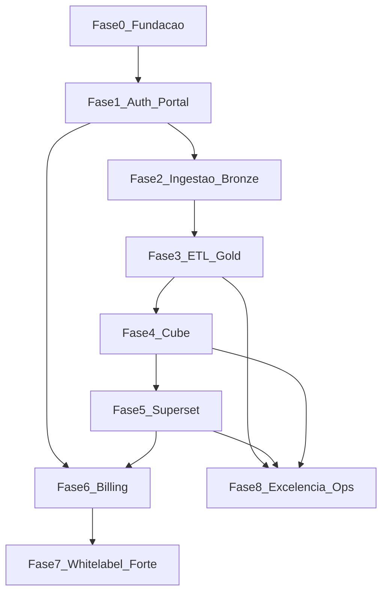

# Plano: solução de dados multitenant (OSS integrado + ETL avançado)

## Escopo alinhado ao documento e às conversas

**Camada de dados:** upload TXT, CSV, XLS/XLSX, JSON; **stage** em object storage; transformações **Silver/Gold** versionadas; retenção e purge; **modelagem e métricas**; consultas aceleradas via **pré-agregações** e cache.

**Produto completo:** MFA (e-mail → WhatsApp), recuperação de senha, cadastro; **grupos e perfis**; **pacotes e cobrança**; **multitenant** + **whitelabel**; **dashboards** e **templates**; **visuais** via stack de BI OSS; **refresh** automático após cargas.

**Diferencial vs Power BI:** UX familiar (exploração, filtros, dashboards), com **tratamento de dados** superior — **dbt** (testes, documentação, lineage SQL), orquestração observável (**Dagster**), camada semântica (**Cube**), governança de camadas e qualidade (**Great Expectations**).

---

## Compromisso de organização (padrão “pronto para vender serviço”)

Este plano existe para que cada entrega seja **revisável**, **reproduzível** e **demonstrável** para um cliente ou investidor: menos retrabalho, menos surpresa em produção, mais velocidade para cobrar. Organização não é burocracia — é o que separa um projeto que gera renda de um projeto que consome tempo.

**Regras de ouro**

1. **Um sub-plano ativo por vez** — terminar com “Saída” verificada antes de abrir o próximo.
2. **Evidência escrita** — cada sub-plano fecha com nota curta no repositório (`CHANGELOG.md` ou entrada em `docs/releases/`) dizendo o que mudou e como validar.
3. **Segredos nunca no Git** — apenas `.env.example` e cofre (senhas em gerenciador ou secrets do CI).
4. **Trilha de decisão** — decisões que mudam arquitetura entram como ADR em `docs/adr/` (título data + contexto + decisão + consequências).

---

## Visão executiva e marcos comerciais

**Marco A — “Laboratório credível” (após P2-07):** upload → bronze funcionando; você consegue **gravar um vídeo** e mostrar dados reais carregando. Serve para conversas com primeiros interessados e parceiros técnicos.

**Marco B — “Produto de dados mínimo” (após P3-03):** pipeline bronze → silver → gold + retenção; argumento forte: *“governança de camadas como enterprise”*.

**Marco C — “BI utilizável” (após P5-04):** dashboard embed no portal com multi-tenant seguro — **primeiro pacote que pode ter preço** (piloto pago ou PoC paga).

**Marco D — “SaaS fechável” (após P6-03):** planos, quotas e bloqueio real — contrato mensal com limites claros.

**Marco E — “Enterprise-ready” (após P7-03 + P8-04):** whitelabel forte, MFA ampliado, observabilidade e auditoria — **upsell** para clientes maiores.

Use estes marcos para **alinhar expectativa de receita** com o que já está objetivamente pronto, sem prometer Fase 8 na semana da Fase 1.

---

## Estrutura recomendada de pastas no repositório

Além do monorepo técnico (`infra/`, `platform-api/`, etc.), reserve:

- `docs/README.md` — índice: visão, como rodar, links ADR, runbooks.
- `docs/adr/` — decisões de arquitetura (uma decisão = um ficheiro datado).
- `docs/runbooks/` — “o que fazer se…” (Postgres cheio, job Dagster preso, Cube não atualiza).
- `docs/commercial/` — **opcional mas poderoso**: planos oferecidos, limites por plano, texto de FAQ para vendas (sem inventar compliance; alinhar com advogado quando for B2B formal).
- `docs/security/` — checklist mínimo (ver secção abaixo).

Isto permite **terceirizar ou contratar** amanhã sem você ser o único que sabe onde tudo está.

---

## Definition of Done (global) — todo sub-plano deve cumprir

Além do critério de **Saída** específico de cada P*-*:

- **Código ou config** versionados; PR pequeno e revisável (idealmente um PR = um sub-plano).
- **Como testar** documentado em 3–8 linhas (comando ou URL).
- **Sem regressão óbvia** — CI verde ou justificativa registrada se ainda não há CI naquele módulo.
- **Observabilidade mínima** — se for fluxo crítico (login, upload, job), log ou evento com `correlation_id` ou `ingestion_id` traçável.

Sub-planos que tocam **dados de cliente** ou **PII**: revisar mentalmente lista **LGPD** (retention, base legal no contrato com cliente, export auditado quando P8-03 existir).

---

## Dependências entre fases (ordem estratégica)

Fase 6 pode iniciar **modelagem** cedo (P6-01) após Fase 1; **enforcement** duro exige ingestão e jobs (P6-03 depois de P2/P3). Fase 8 é transversal mas formaliza após existir tráfego real a observar.

---

## Registro de riscos (prioridade para quem depende do projeto financeiramente)

| Risco                              | Impacto                     | Mitigação no plano                                      |
| ---------------------------------- | --------------------------- | ------------------------------------------------------- |
| Escopo infinito (“igual Power BI”) | Atrasa receita              | Marcos A–E; cortar micro-paridade até ter Marco C       |
| Vazamento entre tenants            | Jurídico + fim da confiança | P5-03 cedo; testes com 2 tenants falsos                 |
| Complexidade dbt multi-tenant      | Atraso técnico              | ADR P0-05; vars e convenções rígidas                    |
| Billing OSS (Kill Bill)            | Curva de tempo              | P6-02 permite **interno primeiro**, Kill Bill depois    |
| Dependência WhatsApp (MFA)         | Bloqueio percebido          | P7-01 isolado; e-mail MFA já em P1-02                   |
| Exaustão / projeto solo            | Abandono                    | sub-planos pequenos + Marco A como vitória visível cedo |

Revise esta tabela **mensalmente** com uma linha: “o que mudou / o que mitigamos”.

---

## Segurança e LGPD (mínimo que deve acompanhar o desenvolvimento)

- **Dados em trânsito:** TLS em produção; em dev pode ser HTTP local, mas documentar diferença.
- **Dados em repouso:** credenciais Postgres/MinIO fortes; buckets não públicos por engano.
- **Acesso:** princípio do menor privilégio nos DB users (Cube/Superset só leitura no gold).
- **Retenção/exclusão:** produto promete isso — implementar conforme P3-03 e política por tenant antes de **grandes** volumes reais.
- **Exportações:** quando existir download em massa, P8-03 audita.
- **Contratos:** texto jurídico com cliente (DPA, subprocessadores) fica **fora** deste plano técnico mas na sua pasta `docs/commercial` ou com assessoria.

---

## Métricas de sucesso (entrega e produto)

**Entrega:** tempo médio para fechar um sub-plano; % de sub-planos com “Como testar” preenchido; incidentes em produção (meta decrescente após P8-04).

**Produto (pós Marco C):** tempo do upload ao gráfico atualizado; taxa de falha de jobs; NPS interno do piloto; **MRR** ou valor de PoCs se aplicável.

---

## Como usar estes planos (execução **uma unidade por vez**)

Cada **sub-plano** abaixo tem ID único (**P**hase **N**úmero), **pré-requisitos**, **entregáveis** e **critério de saída**. Regra: **só iniciar o próximo** quando o critério de saída do atual estiver verificado (teste manual ou automatizado). Sub-planos marcados **(Opcional)** podem ser saltados sem bloquear o núcleo, exceto onde o texto diga o contrário.

O frontmatter YAML deste arquivo lista os mesmos IDs como `todos` para acompanhamento no Cursor.

---

## Índice de sub-planos por fase

- **Fase 0:** [P0-01](#p0-01) … [P0-07](#p0-07)
- **Fase 1:** [P1-01](#p1-01) … [P1-06](#p1-06)
- **Fase 2:** [P2-01](#p2-01) … [P2-07](#p2-07)
- **Fase 3:** [P3-01](#p3-01) … [P3-05](#p3-05)
- **Fase 4:** [P4-01](#p4-01) … [P4-04](#p4-04)
- **Fase 5:** [P5-01](#p5-01) … [P5-06](#p5-06)
- **Fase 6:** [P6-01](#p6-01) … [P6-04](#p6-04)
- **Fase 7:** [P7-01](#p7-01) … [P7-03](#p7-03)
- **Fase 8:** [P8-01](#p8-01) … [P8-04](#p8-04)

---

---

## Sub-planos detalhados

Cada tarefa está em `sub-planos/P0-01.md`, `sub-planos/P0-02.md`, … Ver [README.md](README.md).

Instruções de uso: [INSTRUCOES-USO-DOS-PLANOS.md](INSTRUCOES-USO-DOS-PLANOS.md). Vários agentes em paralelo: [PLANO-MULTI-AGENTES.md](PLANO-MULTI-AGENTES.md).
