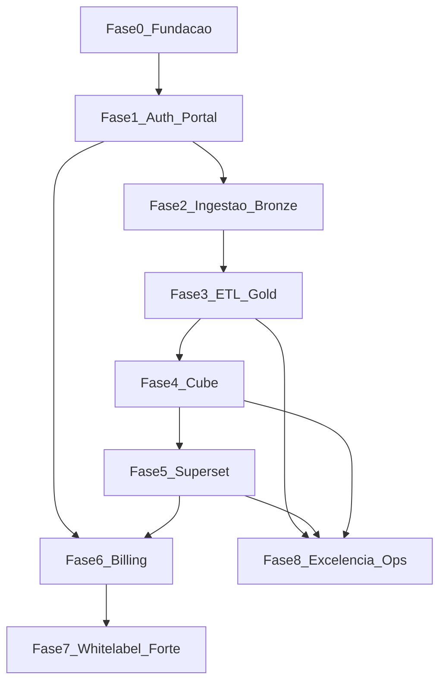
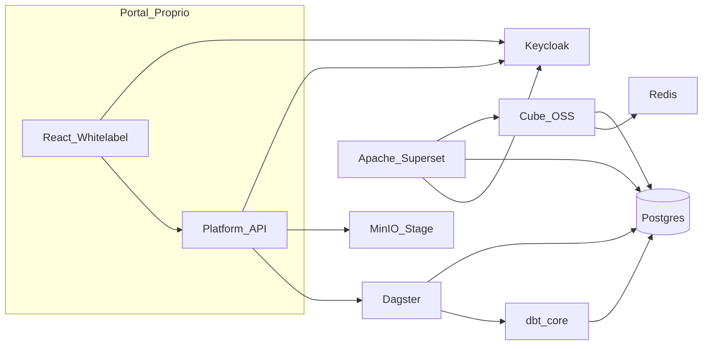

# Plano: solução de dados multitenant (OSS integrado + ETL avançado)

> **Planeamento separado por ficheiro:** para execução incremental, use [README.md](README.md) e a pasta [sub-planos/](sub-planos/) (`P0-01.md` … `P8-04.md`). Peça ao assistente: «Executa o sub-plano **P0-01**» com o ficheiro correspondente aberto ou anexado.

---

## Escopo alinhado ao documento e às conversas

**Camada de dados:** upload TXT, CSV, XLS/XLSX, JSON; **stage** em object storage; transformações **Silver/Gold** versionadas; retenção e purge; **modelagem e métricas**; consultas aceleradas via **pré-agregações** e cache.

**Produto completo:** MFA (e-mail → WhatsApp), recuperação de senha, cadastro; **grupos e perfis**; **pacotes e cobrança**; **multitenant** + **whitelabel**; **dashboards** e **templates**; **visuais** via stack de BI OSS; **refresh** automático após cargas.

**Diferencial vs Power BI:** UX familiar (exploração, filtros, dashboards), com **tratamento de dados** superior — **dbt** (testes, documentação, lineage SQL), orquestração observável (**Dagster**), camada semântica (**Cube**), governança de camadas e qualidade (**Great Expectations**).

---

## Compromisso de organização (padrão “pronto para vender serviço”)

Este plano existe para que cada entrega seja **revisável**, **reproduzível** e **demonstrável** para um cliente ou investidor: menos retrabalho, menos surpresa em produção, mais velocidade para cobrar. Organização não é burocracia — é o que separa um projeto que gera renda de um projeto que consome tempo.

**Regras de ouro**

1. **Um sub-plano ativo por vez** — terminar com “Saída” verificada antes de abrir o próximo.
2. **Evidência escrita** — cada sub-plano fecha com nota curta no repositório (`CHANGELOG.md` ou entrada em `docs/releases/`) dizendo o que mudou e como validar.
3. **Segredos nunca no Git** — apenas `.env.example` e cofre (senhas em gerenciador ou secrets do CI).
4. **Trilha de decisão** — decisões que mudam arquitetura entram como ADR em `docs/adr/` (título data + contexto + decisão + consequências).

---

## Visão executiva e marcos comerciais

**Marco A — “Laboratório credível” (após P2-07):** upload → bronze funcionando; você consegue **gravar um vídeo** e mostrar dados reais carregando. Serve para conversas com primeiros interessados e parceiros técnicos.

**Marco B — “Produto de dados mínimo” (após P3-03):** pipeline bronze → silver → gold + retenção; argumento forte: *“governança de camadas como enterprise”*.

**Marco C — “BI utilizável” (após P5-04):** dashboard embed no portal com multi-tenant seguro — **primeiro pacote que pode ter preço** (piloto pago ou PoC paga).

**Marco D — “SaaS fechável” (após P6-03):** planos, quotas e bloqueio real — contrato mensal com limites claros.

**Marco E — “Enterprise-ready” (após P7-03 + P8-04):** whitelabel forte, MFA ampliado, observabilidade e auditoria — **upsell** para clientes maiores.

Use estes marcos para **alinhar expectativa de receita** com o que já está objetivamente pronto, sem prometer Fase 8 na semana da Fase 1.

---

## Estrutura recomendada de pastas no repositório

Além do monorepo técnico (`infra/`, `platform-api/`, etc.), reserve:

- `docs/README.md` — índice: visão, como rodar, links ADR, runbooks.
- `docs/adr/` — decisões de arquitetura (uma decisão = um ficheiro datado).
- `docs/runbooks/` — “o que fazer se…” (Postgres cheio, job Dagster preso, Cube não atualiza).
- `docs/commercial/` — **opcional mas poderoso**: planos oferecidos, limites por plano, texto de FAQ para vendas (sem inventar compliance; alinhar com advogado quando for B2B formal).
- `docs/security/` — checklist mínimo (ver secção abaixo).

Isto permite **terceirizar ou contratar** amanhã sem você ser o único que sabe onde tudo está.

---

## Definition of Done (global) — todo sub-plano deve cumprir

Além do critério de **Saída** específico de cada P*-*:

- **Código ou config** versionados; PR pequeno e revisável (idealmente um PR = um sub-plano).
- **Como testar** documentado em 3–8 linhas (comando ou URL).
- **Sem regressão óbvia** — CI verde ou justificativa registrada se ainda não há CI naquele módulo.
- **Observabilidade mínima** — se for fluxo crítico (login, upload, job), log ou evento com `correlation_id` ou `ingestion_id` traçável.

Sub-planos que tocam **dados de cliente** ou **PII**: revisar mentalmente lista **LGPD** (retention, base legal no contrato com cliente, export auditado quando P8-03 existir).

---

## Dependências entre fases (ordem estratégica)

Fase 6 pode iniciar **modelagem** cedo (P6-01) após Fase 1; **enforcement** duro exige ingestão e jobs (P6-03 depois de P2/P3). Fase 8 é transversal mas formaliza após existir tráfego real a observar.

---

## Registro de riscos (prioridade para quem depende do projeto financeiramente)

| Risco                              | Impacto                     | Mitigação no plano                                      |
| ---------------------------------- | --------------------------- | ------------------------------------------------------- |
| Escopo infinito (“igual Power BI”) | Atrasa receita              | Marcos A–E; cortar micro-paridade até ter Marco C       |
| Vazamento entre tenants            | Jurídico + fim da confiança | P5-03 cedo; testes com 2 tenants falsos                 |
| Complexidade dbt multi-tenant      | Atraso técnico              | ADR P0-05; vars e convenções rígidas                    |
| Billing OSS (Kill Bill)            | Curva de tempo              | P6-02 permite **interno primeiro**, Kill Bill depois    |
| Dependência WhatsApp (MFA)         | Bloqueio percebido          | P7-01 isolado; e-mail MFA já em P1-02                   |
| Exaustão / projeto solo            | Abandono                    | sub-planos pequenos + Marco A como vitória visível cedo |

Revise esta tabela **mensalmente** com uma linha: “o que mudou / o que mitigamos”.

---

## Segurança e LGPD (mínimo que deve acompanhar o desenvolvimento)

- **Dados em trânsito:** TLS em produção; em dev pode ser HTTP local, mas documentar diferença.
- **Dados em repouso:** credenciais Postgres/MinIO fortes; buckets não públicos por engano.
- **Acesso:** princípio do menor privilégio nos DB users (Cube/Superset só leitura no gold).
- **Retenção/exclusão:** produto promete isso — implementar conforme P3-03 e política por tenant antes de **grandes** volumes reais.
- **Exportações:** quando existir download em massa, P8-03 audita.
- **Contratos:** texto jurídico com cliente (DPA, subprocessadores) fica **fora** deste plano técnico mas na sua pasta `docs/commercial` ou com assessoria.

---

## Métricas de sucesso (entrega e produto)

**Entrega:** tempo médio para fechar um sub-plano; % de sub-planos com “Como testar” preenchido; incidentes em produção (meta decrescente após P8-04).

**Produto (pós Marco C):** tempo do upload ao gráfico atualizado; taxa de falha de jobs; NPS interno do piloto; **MRR** ou valor de PoCs se aplicável.

---

## Como usar estes planos (execução **uma unidade por vez**)

Cada **sub-plano** abaixo tem ID único (**P**hase **N**úmero), **pré-requisitos**, **entregáveis** e **critério de saída**. Regra: **só iniciar o próximo** quando o critério de saída do atual estiver verificado (teste manual ou automatizado). Sub-planos marcados **(Opcional)** podem ser saltados sem bloquear o núcleo, exceto onde o texto diga o contrário.

O frontmatter YAML deste arquivo lista os mesmos IDs como `todos` para acompanhamento no Cursor.

---

## Índice de sub-planos por fase

- **Fase 0:** [P0-01](#p0-01) … [P0-07](#p0-07)
- **Fase 1:** [P1-01](#p1-01) … [P1-06](#p1-06)
- **Fase 2:** [P2-01](#p2-01) … [P2-07](#p2-07)
- **Fase 3:** [P3-01](#p3-01) … [P3-05](#p3-05)
- **Fase 4:** [P4-01](#p4-01) … [P4-04](#p4-04)
- **Fase 5:** [P5-01](#p5-01) … [P5-06](#p5-06)
- **Fase 6:** [P6-01](#p6-01) … [P6-04](#p6-04)
- **Fase 7:** [P7-01](#p7-01) … [P7-03](#p7-03)
- **Fase 8:** [P8-01](#p8-01) … [P8-04](#p8-04)

---

## Fase 0 — Fundação

### P0-01 — Monorepo e convenções

- **Pré-requisitos:** nenhum.
- **Escopo:** criar monorepo em `[/opt/data_4tech](/opt/data_4tech)` com pastas `infra/`, `platform-api/`, `portal/`, `dbt/`, `dagster/`; README com nomenclatura `tenant_id`, `workspace_id`, versão de API.
- **Entregáveis:** estrutura versionada; `.editorconfig` opcional.
- **Saída:** repositório clonável e documentado.

### P0-02 — Postgres e Redis (Compose)

- **Pré-requisitos:** P0-01.
- **Escopo:** `docker-compose` (ou fragmento) com Postgres 15+ e Redis; volumes nomeados; rede interna; variáveis `.env.example`.
- **Entregáveis:** comando único `docker compose up` sobe ambos; healthchecks.
- **Saída:** `psql` e `redis-cli ping` funcionam no ambiente dev.

### P0-03 — MinIO stage

- **Pré-requisitos:** P0-01 (pode paralelizar com P0-02 após P0-01).
- **Escopo:** serviço MinIO; bucket `stage` (ou prefixo por env); usuário app só para bucket necessário.
- **Entregáveis:** script ou doc de criação de bucket; credenciais só em env.
- **Saída:** upload/download CLI (`mc` ou boto3) validado.

### P0-04 — Keycloak realm e client OIDC

- **Pré-requisitos:** P0-02.
- **Escopo:** Keycloak em Compose; realm `probi-dev`; client **confidencial** ou **public** conforme padrão SPA; redirect URIs do portal localhost.
- **Entregáveis:** export realm JSON versionado **sem secrets** ou script de bootstrap.
- **Saída:** fluxo authorization code no painel Keycloak testado.

### P0-05 — Decisão multitenant Postgres

- **Pré-requisitos:** P0-02.
- **Escopo:** documento curto: **schema por tenant** `t_{uuid}_bronze|silver|gold` **vs** RLS em tabelas compartilhadas; escolha inicial e migração futura.
- **Entregáveis:** ADR em `docs/adr-001-multitenant-postgres.md` (ou equivalente no README).
- **Saída:** equipe alinha padrão único para P2/P3.

### P0-06 — platform-api esqueleto

- **Pré-requisitos:** P0-02, P0-03.
- **Escopo:** app mínima (FastAPI/Nest) com `/health`, conexão Postgres (pool) e cliente S3 MinIO; sem regras de negócio ainda.
- **Entregáveis:** Dockerfile opcional; teste de integração leve ou script `curl`.
- **Saída:** health retorna OK com dependências vivas.

### P0-07 — CI mínimo

- **Pré-requisitos:** P0-06.
- **Escopo:** pipeline que instala deps, roda lint/format e testes vazios ou unitários do esqueleto.
- **Entregáveis:** GitHub Actions / GitLab CI snippet no repositório.
- **Saída:** CI verde no branch principal.

---

## Fase 1 — Identidade e portal

### P1-01 — Email verify e reset de senha

- **Pré-requisitos:** P0-04.
- **Escopo:** Keycloak: SMTP de dev (Mailhog/Mailpit); fluxos **Verify Email** e **Forgot Password**; templates PT-BR básicos.
- **Entregáveis:** documento como testar com caixa de email local.
- **Saída:** usuário de teste completa verify + reset ponta a ponta.

### P1-02 — MFA (e-mail ou TOTP)

- **Pré-requisitos:** P1-01.
- **Escopo:** habilitar OTP por email ou TOTP; política **Conditional** (ex.: obrigatório para grupo `tenant-admin`).
- **Entregáveis:** captura de fluxo ou checklist de teste.
- **Saída:** login de admin exige segundo fator em dev.

### P1-03 — Grupos e claims

- **Pré-requisitos:** P1-02.
- **Escopo:** grupos `tenant-admin`, `analyst`, `consumer`; mapper JWT com `tenant_id` (atributo usuário ou group path).
- **Entregáveis:** exemplo de **JWT decodificado** na doc.
- **Saída:** `platform-api` consegue validar JWT e ler `tenant_id` (teste P1-06 pode depender disso).

### P1-04 — Portal OIDC

- **Pré-requisitos:** P0-04, P1-03.
- **Escopo:** React + lib OIDC (`react-oidc-context` ou similar); login redirect; silent renew se aplicável; página pós-login protegida.
- **Entregáveis:** variáveis `VITE_`* documentadas.
- **Saída:** usuário vê nome/email após login.

### P1-05 — Whitelabel mínimo

- **Pré-requisitos:** P1-04, P0-06.
- **Escopo:** endpoint `GET /tenants/:id/branding` retorna logo URL, cores; portal aplica CSS variables no `:root`.
- **Entregáveis:** tenant seed com branding default.
- **Saída:** mudar cor no JSON altera tema visualmente.

### P1-06 — Sincronização metadados tenant/usuário

- **Pré-requisitos:** P1-04, P0-06.
- **Escopo:** no primeiro login válido, **upsert** `users` e vínculo `memberships` no Postgres app (via evento ou rota `/me/sync` chamada pelo portal).
- **Entregáveis:** migração Flyway/Alembic das tabelas.
- **Saída:** registro de usuário aparece no banco app após login.

---

## Fase 2 — Ingestão Bronze

### P2-01 — Upload para MinIO

- **Pré-requisitos:** P0-03, P0-06, P1-03 (auth na API).
- **Escopo:** endpoint autenticado: **presigned PUT** ou recebe multipart e grava em `stage/{tenant}/{workspace}/{upload_id}/file.ext`.
- **Entregáveis:** limite de tamanho configurável; tipos MIME permitidos iniciais.
- **Saída:** arquivo visível no MinIO e metadado gravado.

### P2-02 — Modelo ingestões e jobs

- **Pré-requisitos:** P2-01.
- **Escopo:** tabelas `ingestions(id, tenant_id, workspace_id, path, status, error, created_at…)`; estados `pending|running|success|failed`.
- **Entregáveis:** API GET lista por workspace.
- **Saída:** upload cria linha `pending`.

### P2-03 — Dagster skeleton

- **Pré-requisitos:** P0-02.
- **Escopo:** projeto Dagster com `Definitions`, recurso Postgres, ambiente local documentado.
- **Entregáveis:** `dagster dev` ou serviço Compose.
- **Saída:** run manual vazio conclui com sucesso.

### P2-04 — Loader CSV/JSON → Bronze

- **Pré-requisitos:** P2-02, P2-03, P0-05 (padrão schema).
- **Escopo:** sensor ou job disparado pela API (webhook, fila ou poll) que lê objeto MinIO e grava tabela `..._bronze.raw_`* (Polars/pandas/copy).
- **Entregáveis:** tratamento de delimitador e `header`.
- **Saída:** CSV de teste vira tabela consultável no `psql`.

### P2-05 — Loader TXT

- **Pré-requisitos:** P2-04.
- **Escopo:** detecção encoding (chardet ou equivalente); linhas como texto ou split configurável.
- **Entregáveis:** fixture TXT na doc.
- **Saída:** arquivo TXT carrega sem mojibake em caso padrão.

### P2-06 — Loader XLSX

- **Pré-requisitos:** P2-04.
- **Escopo:** leitura streaming/limitada de linhas; rejeitar arquivo acima do limite.
- **Entregáveis:** constantes `MAX_ROWS`, `MAX_MB` documentadas.
- **Saída:** xlsx pequeno vira bronze; grande retorna erro controlado.

### P2-07 — UI histórico ingestões

- **Pré-requisitos:** P2-02, P1-04.
- **Escopo:** tabela na portal com status e link para erro; polling ou SSE opcional.
- **Saída:** usuário vê progresso após upload.

---

## Fase 3 — Silver / Gold e governança

### P3-01 — Projeto dbt camadas

- **Pré-requisitos:** P2-04, P0-05.
- **Escopo:** `models/staging`, `models/silver`, `models/gold`; `sources.yml` apontando bronze; vars `tenant_id`.
- **Entregáveis:** `dbt docs generate` local.
- **Saída:** `dbt run --select silver` materializa tabelas esperadas para fixture.

### P3-02 — Dagster orquestra dbt

- **Pré-requisitos:** P3-01, P2-03.
- **Escopo:** `dbt run` + `dbt test` após load bronze; passar vars; falha marca ingestion `failed`.
- **Entregáveis:** logs vinculados ao `ingestion_id`.
- **Saída:** pipeline ponta a ponta para um arquivo demo.

### P3-03 — Retenção e purge

- **Pré-requisitos:** P2-01, P3-02.
- **Escopo:** políticas por tenant/workspace (dias em stage, dias em bronze); jobs Dagster + campos configuráveis via API.
- **Entregáveis:** teste com datas simuladas ou buckets pequenos.
- **Saída:** objetos/tuplas antigas removidos conforme política.

### P3-04 — Great Expectations mínimo

- **Pré-requisitos:** P3-02.
- **Escopo:** suite GE (ex.: não nulo em PK, ranges) após silver; falha opcional bloqueia promoção gold.
- **Entregáveis:** relatório HTML ou JSON armazenado em MinIO/postgres.
- **Saída:** violação gera alerta visível na API/UI.

### P3-05 — (Opcional) OpenLineage + Marquez

- **Pré-requisitos:** P3-02.
- **Escopo:** emitir eventos run start/complete; Marquez UI local.
- **Saída:** lineage visível para run de demo.

---

## Fase 4 — Cube (semântica)

### P4-01 — Cube deploy e conexão

- **Pré-requisitos:** P3-02 (gold populado em dev).
- **Escopo:** Cube em Docker; credenciais Postgres somente leitura em `gold`.
- **Entregáveis:** `cube.js` / env documentados.
- **Saída:** Playground Cube retorna query agregada.

### P4-02 — Modelo semântico

- **Pré-requisitos:** P4-01.
- **Escopo:** cubes principais, joins, medidas; comentários YAML.
- **Entregáveis:** exemplo REST/GraphQL na doc.
- **Saída:** mesma métrica bate com query SQL manual.

### P4-03 — Pre-aggregations e Redis

- **Pré-requisitos:** P4-02, P0-02.
- **Escopo:** uma `preAggregation` de exemplo; Redis como cache.
- **Entregáveis:** comparação latência antes/depois (nota qualitativa).
- **Saída:** rebuild de pre-agg conclui sem erro.

### P4-04 — Refresh pós-dbt

- **Pré-requisitos:** P3-02, P4-02.
- **Escopo:** ao sucesso do `dbt`, chamar **Cube refresh** (deploy hook ou API); idempotente.
- **Entregáveis:** segredo de API Cube só no backend.
- **Saída:** dados novos visíveis no Playground após nova carga.

---

## Fase 5 — Superset e templates

### P5-01 — Superset e datasource

- **Pré-requisitos:** P4-02 ou gold direto.
- **Escopo:** Superset em Compose; database apontando **Cube SQL** (preferido) ou Postgres `gold`; dataset de teste.
- **Entregáveis:** usuário admin Superset inicial via env.
- **Saída:** chart simples renderiza.

### P5-02 — OIDC Keycloak no Superset

- **Pré-requisitos:** P5-01, P0-04.
- **Escopo:** `AUTH_TYPE = OIDC`; mapear roles Keycloak → Superset (mínimo).
- **Entregáveis:** doc de claims necessários.
- **Saída:** mesmo usuário Keycloak acessa Superset.

### P5-03 — Custom Security Manager multitenant

- **Pré-requisitos:** P5-02, P1-03.
- **Escopo:** filtro de schema ou cláusula RLS injetada; impedir acesso cross-tenant em SQL Lab se aplicável.
- **Entregáveis:** teste com dois tenants fake.
- **Saída:** usuário tenant A não vê dados B.

### P5-04 — Embed no portal

- **Pré-requisitos:** P5-03, P1-04.
- **Escopo:** **Guest Token** ou embed seguro; rota no portal `/dashboards/:id`.
- **Entregáveis:** expiração token curta.
- **Saída:** iframe ou componente embutido mostra dashboard.

### P5-05 — Templates

- **Pré-requisitos:** P5-01.
- **Escopo:** export ZIP/dashboard API Superset; tabela `dashboard_templates` na API com `superset_dashboard_id` + metadados; ação “instalar template” clona para workspace.
- **Entregáveis:** um template demo versionado.
- **Saída:** segundo workspace clona dashboard sem reconstruir manualmente tudo.

### P5-06 — Atualização automática visual

- **Pré-requisitos:** P4-04, P5-04.
- **Escopo:** evento `dataset_ready` (fila ou webhook) → portal recebe WS/poll ou Superset **cache warmup** / refresh programático.
- **Entregáveis:** SLA de refresh documentado (ex.: “best effort < 60s”).
- **Saída:** nova carga reflete no embed sem intervenção manual.

---

## Fase 6 — Billing e entitlements

### P6-01 — Modelo comercial no Postgres

- **Pré-requisitos:** P1-06.
- **Escopo:** `plans`, `subscriptions`, `quotas` (storage_mb, seats, jobs_per_day, dashboard_count); vínculo tenant.
- **Entregáveis:** seed de 2–3 planos.
- **Saída:** API GET expõe plano atual do tenant.

### P6-02 — Kill Bill ou billing interno

- **Pré-requisitos:** P6-01.
- **Escopo:** ou integração Kill Bill (tenant = account) ou serviço **internal** com faturas simplificadas + integração **gateway** (Stripe/outro) fora do núcleo OSS.
- **Entregáveis:** webhook de pagamento confirma `subscription` ativa.
- **Saída:** mudança de plano reflete em `subscriptions`.

### P6-03 — Enforcement

- **Pré-requisitos:** P6-01, P2-01, P2-03.
- **Escopo:** middleware recusa upload se storage excedido; recusa novo `consumer` se seats esgotados; limite de jobs diários.
- **Entregáveis:** respostas HTTP 402/403 com código de erro estável.
- **Saída:** teste automatizado ou script que excede quota e falha.

### P6-04 — UI planos

- **Pré-requisitos:** P6-02, P1-04.
- **Escopo:** página “Plano e uso” com medidores (storage, seats).
- **Saída:** admin vê limites e consumo atual.

---

## Fase 7 — WhatsApp MFA e domínio

### P7-01 — OTP WhatsApp

- **Pré-requisitos:** P1-02.
- **Escopo:** microserviço que envia código via API do provedor; Keycloak **Required Action** custom ou broker que valida código.
- **Entregáveis:** fallback e-mail se WhatsApp falhar.
- **Saída:** MFA WhatsApp em staging com número de teste.

### P7-02 — Host e TLS por tenant

- **Pré-requisitos:** P1-05.
- **Escopo:** Traefik/Caddy com roteamento `Host`; ACME; mapa `tenant_id → hostname` na API.
- **Entregáveis:** doc de DNS wildcard vs registro por cliente.
- **Saída:** dois hostnames locais (simulados) abrem branding distinto.

### P7-03 — Tema Keycloak por tenant

- **Pré-requisitos:** P7-02.
- **Escopo:** login theme custom injeta logo/cores do tenant (por hostname ou query).
- **Entregáveis:** assets servidos de CDN ou MinIO público restrito.
- **Saída:** tela de login distingue marca visualmente dois tenants.

---

## Fase 8 — Excelência dados e operações

### P8-01 — Great Expectations ampliado

- **Pré-requisitos:** P3-04.
- **Escopo:** suites por entidade; relatório de falhas na portal para `DataAdmin`.
- **Saída:** falhas bloqueiam promoção ou apenas alertam (configurável).

### P8-02 — Performance Cube e Postgres

- **Pré-requisitos:** P4-03, P3-02.
- **Escopo:** partitions no Cube; índices/particionamento em tabelas gold grandes; analisar `EXPLAIN` de consultas frequentes.
- **Entregáveis:** checklist de tuning.
- **Saída:** latência p95 documentada melhora em cenário de teste.

### P8-03 — Auditoria de exportação (LGPD)

- **Pré-requisitos:** P5-04.
- **Escopo:** log append-only `export_audit(user_id, tenant_id, resource, format, ts)` em qualquer download CSV/Excel do BI (API Superset ou proxy).
- **Saída:** relatório de exportações por tenant.

### P8-04 — Observabilidade

- **Pré-requisitos:** P0-02.
- **Escopo:** Prometheus scrape exporters; dashboards Grafana (Dagster, Postgres, Cube, Superset); Loki para logs; alertas básicos (run falhou, fila atrasada).
- **Saída:** um alerta de teste dispara em ambiente dev.

---

## Stack open-source (referência rápida)

Objetivo: **maximizar ferramentas maduras** e uma **camada fina** (`platform-api` + `portal`) para upload, billing, whitelabel e provisionamento.

| Camada         | Ferramenta OSS            | Papel                    |
| -------------- | ------------------------- | ------------------------ |
| Identidade     | Keycloak                  | OIDC, MFA, grupos        |
| Storage        | MinIO                     | Stage / artefatos        |
| Warehouse      | PostgreSQL                | App + bronze/silver/gold |
| Orquestração   | Dagster                   | Jobs e dependências      |
| Transformação  | dbt-core                  | SQL versionado, testes   |
| Lineage (opc.) | OpenLineage + Marquez     | Grafo                    |
| Semântica      | Cube                      | Métricas, cache, API     |
| BI             | Apache Superset           | Dashboards, SQL Lab      |
| Cache          | Redis                     | Cube / filas / Superset  |
| Qualidade      | Great Expectations        | Expectativas             |
| Billing (opc.) | Kill Bill                 | Assinaturas OSS          |
| Ingresso       | Traefik / Caddy           | Rotas, TLS               |
| Ops            | Prometheus, Grafana, Loki | SRE                      |

---

## Como os componentes se cruzam (fluxo ponta a ponta)

---

## Camada própria mínima

- **platform-api:** metadados, quotas, upload, webhooks Dagster/Cube, billing, auditoria.
- **portal:** OIDC, whitelabel, lista/embed dashboards, templates.

---

## Riscos e mitigação

- **Multitenant no Superset:** investir cedo no **security manager** e usar **Cube** como fonte única de métricas.
- **dbt multi-tenant:** vars e seleção de modelos por workspace; projetos pequenos e composáveis.
- **Kill Bill:** curva alta — MVP pode ser billing interno (P6-02) e Kill Bill depois.
- **WhatsApp:** isolado em P7-01; não bloqueia núcleo.

---

## Repositório alvo

Workspace `[/opt/data_4tech](/opt/data_4tech)`: implementação começa por **P0-01** quando você autorizar execução fora do modo plano.