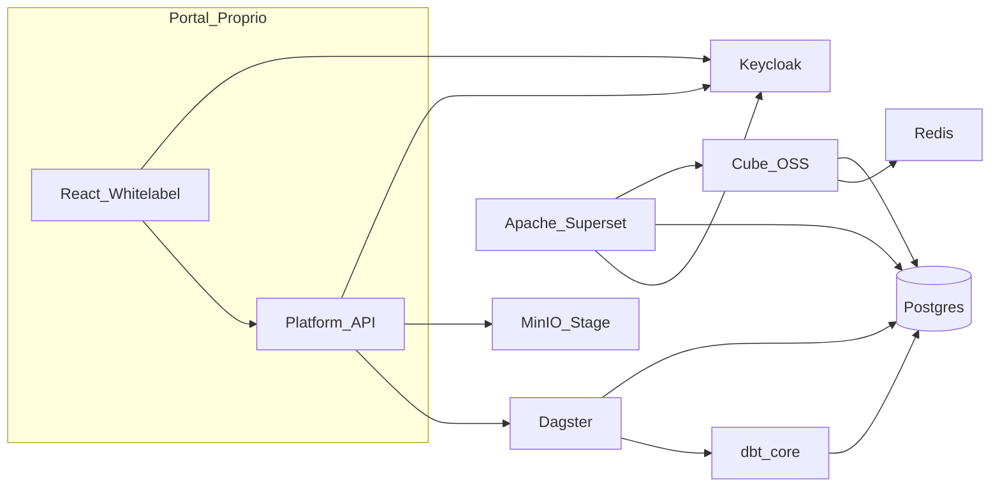

# P8-04 — Observabilidade

- **Pré-requisitos:** P0-02.
- **Escopo:** Prometheus scrape exporters; dashboards Grafana (Dagster, Postgres, Cube, Superset); Loki para logs; alertas básicos (run falhou, fila atrasada).
- **Saída:** um alerta de teste dispara em ambiente dev.

---

## Stack open-source (referência rápida)

Objetivo: **maximizar ferramentas maduras** e uma **camada fina** (`platform-api` + `portal`) para upload, billing, whitelabel e provisionamento.

| Camada         | Ferramenta OSS            | Papel                    |
| -------------- | ------------------------- | ------------------------ |
| Identidade     | Keycloak                  | OIDC, MFA, grupos        |
| Storage        | MinIO                     | Stage / artefatos        |
| Warehouse      | PostgreSQL                | App + bronze/silver/gold |
| Orquestração   | Dagster                   | Jobs e dependências      |
| Transformação  | dbt-core                  | SQL versionado, testes   |
| Lineage (opc.) | OpenLineage + Marquez     | Grafo                    |
| Semântica      | Cube                      | Métricas, cache, API     |
| BI             | Apache Superset           | Dashboards, SQL Lab      |
| Cache          | Redis                     | Cube / filas / Superset  |
| Qualidade      | Great Expectations        | Expectativas             |
| Billing (opc.) | Kill Bill                 | Assinaturas OSS          |
| Ingresso       | Traefik / Caddy           | Rotas, TLS               |
| Ops            | Prometheus, Grafana, Loki | SRE                      |

---

## Como os componentes se cruzam (fluxo ponta a ponta)

---

## Camada própria mínima

- **platform-api:** metadados, quotas, upload, webhooks Dagster/Cube, billing, auditoria.
- **portal:** OIDC, whitelabel, lista/embed dashboards, templates.

---

## Riscos e mitigação

- **Multitenant no Superset:** investir cedo no **security manager** e usar **Cube** como fonte única de métricas.
- **dbt multi-tenant:** vars e seleção de modelos por workspace; projetos pequenos e composáveis.
- **Kill Bill:** curva alta — MVP pode ser billing interno (P6-02) e Kill Bill depois.
- **WhatsApp:** isolado em P7-01; não bloqueia núcleo.

---

## Repositório alvo

Workspace `[/opt/data_4tech](/opt/data_4tech)`: implementação começa por **P0-01** quando você autorizar execução fora do modo plano.

---

## Ao pedir execução no Cursor

Diga: **«Executa o sub-plano `P8-04`»** e anexe este ficheiro (`P8-04.md`). Só o escopo abaixo deve ser implementado num único ciclo/PR.

